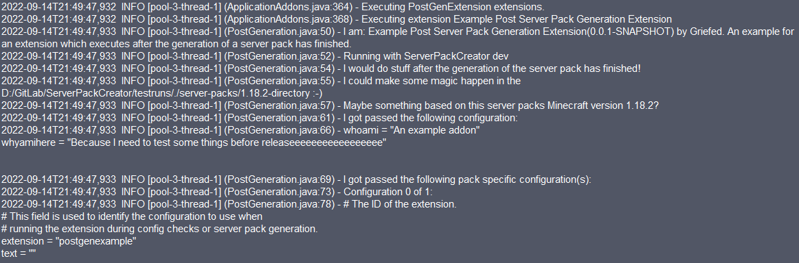
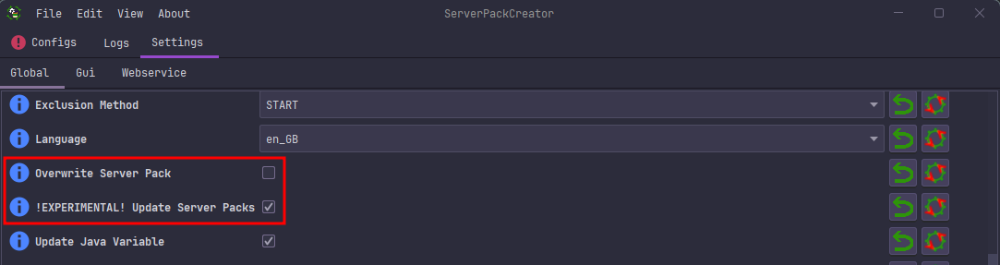
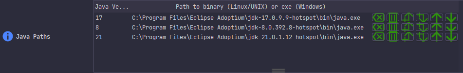
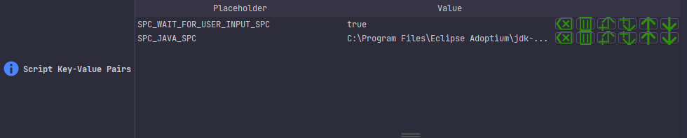
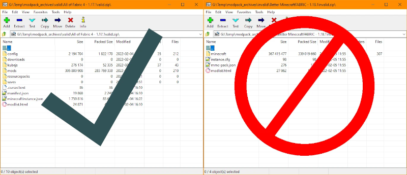
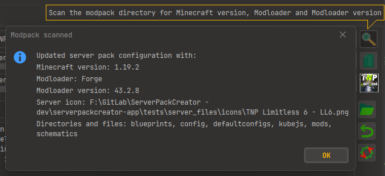
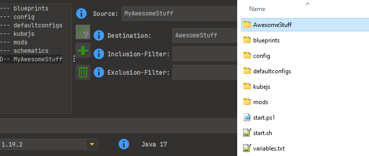
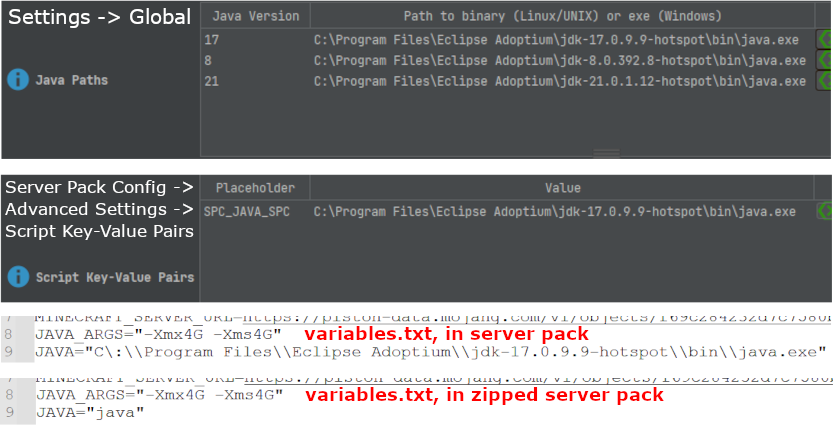
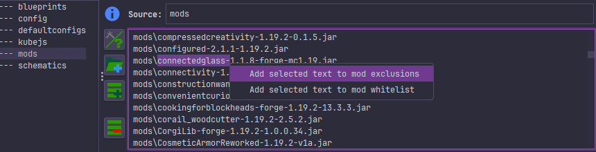

<topic title="Tips, tricks and help" id="help-library" is-library="true">

# Tips, tricks and help

## Custom Themes

As of 5.0.0 you can create your own themes for ServerPackCreator. To get an idea on what a custom theme looks like,
take a look at the different `properties`-files inside the `themes`-directory when using ServerPackCreators GUI.

To see the examples in action, browse to *Settings -> GUI* and select any of the following from the themes-dropdown:

- BisectHosting
- Chorb
- Elocin
- Kreezxil
- ModernGamingWorld

They're people, or in the case of BisectHosting a company, which have had a noticeable impact on ServerPackCreator in a
good way. So as a little "Thank You", I've decided to add custom themes in their name.

The FormDev theme editor was used in the creation of these themes. You can get it here:
https://www.formdev.com/flatlaf/theme-editor/#download

Run the downloaded JAR-file and point it towards the themes-directory. That will allow you to take a proper look at the
custom themes, along with a preview of your changes.

FormDevs documentation for customization is pretty nice. I suggest you take a thorough look at it over at:
https://www.formdev.com/flatlaf/customizing/

Experiment with the existing themes, create your own and have fun!

Every .properties-file in the themes-folder will automatically be added to the list of available themes inside
ServerPackCreator. If you've added or changed a theme whilst running ServerPackCreator, you will need to restart it for
the changes to take effect.

Request for theme creations will be ignored. Please be aware that I implemented this feature so YOU can create themes.
Not in order for ME to create themes FOR you. :D

Happy theming!

## Start Script Templates (3.8.x and up)

Inside the `server_files`-directory you will find the three default templates:

1. `default_template.ps1`
2. `default_template.sh`
3. `default-template.bat`

You have two options now:

1. Edit the existing default templates to your liking and saving them under a different name
2. Create your own templates or add additional ones for different file-endings

### Powershell

> **Windows Updates**
> Sometimes, Windows updates reset the execution policy of PowerShell scripts, which in turn requires
> you, the user, to change it again. Should PowerShell scripts display the behaviour of *Opening and
then immediately closing* again, consult the **Running Powershell scripts**-section again below.
> {.is-warning}


> **Paths with spaces**
> Powershell scripts by default can not be opened with a double-click if the path to said script
> contains spaces. If you wish to remedy this or want to read more about this behaviour, this article
> talks about it in great detail:
[Fix Problem Where Windows PowerShell Cannot Run Script Whose Path Contains Spaces](https://blog.danskingdom.com/fix-problem-where-windows-powershell-cannot-run-script-whose-path-contains-spaces/)<br>
> Keep in mind though that things may still break when working with paths with spaces in them. If
> things still break with a path with spaces, even after trying the fixes from the link above, then I
> suggest moving things to a folder whose path contains no spaces. I'm afraid there's nothing I can do
> about that.
> {.is-warning}

> **Running Powershell scripts**
> By default, running Powershell scripts from untrusted sources is probably disabled on your system.
> As such, you will not be able to run the `start.ps`-scripts just yet. You need to allow running
> unsigned scripts first. See https://superuser.com/a/106363 for a short explanation on how to
> enable/allow running unsigned scripts with Powershell.
> Bear in mind that this introduces a security risk on your system. After making the changes from the
> link above, you can run any Powershell script you like, and as such, introduce any and all security
> risk into your system. So, beware when running scripts from unknown sources. If you run the
> exectuion-policy command from a non-administrator terminal, you may be prompted with a question as
> to how exactly you would like to adjust it. When this happens, please select `[Y]`, as any other option is potentially
> more dangerous.
> {.is-warning}

### Default values

ServerPackCreator always supplies a couple of default key-value-pairs during script creation.
These are stored in a separate file called `variables.txt`.

The following placeholders will be replaced by ServerPackCreator during the creation of the scripts and variables.txt.

| Key                                    | Value                                                                                                                                                                                                                                                                                                                                                                                                                                                                                                           |
|----------------------------------------|-----------------------------------------------------------------------------------------------------------------------------------------------------------------------------------------------------------------------------------------------------------------------------------------------------------------------------------------------------------------------------------------------------------------------------------------------------------------------------------------------------------------|
| SPC_SERVERPACKCREATOR_VERSION_SPC      | The version of ServerPackCreator with which the start script was created.                                                                                                                                                                                                                                                                                                                                                                                                                                       |
| SPC_MINECRAFT_VERSION_SPC              | The Minecraft version of the modpack from which the server pack is created.                                                                                                                                                                                                                                                                                                                                                                                                                                     |
| SPC_MODLOADER_SPC                      | The modloader of the modpack from which the server pack is created.                                                                                                                                                                                                                                                                                                                                                                                                                                             |
| SPC_MODLOADER_VERSION_SPC              | The modloader version of the modpack from which the server pack is created.                                                                                                                                                                                                                                                                                                                                                                                                                                     |
| SPC_JAVA_ARGS_SPC                      | Java JVM args which are to be used when running the server pack.                                                                                                                                                                                                                                                                                                                                                                                                                                                |
| SPC_JAVA_SPC                           | `java` by default. Start scripts in ZIP-archives will always receive `java` as the value. You may change the value in the table provided in the GUI if you need a different Java path for local testing and debugging. Scripts in the unzipped server pack will have the custom value avaiable.                                                                                                                                                                                                                 |
| SPC_FABRIC_INSTALLER_VERSION_SPC       | The latest release version of the Fabric installer during creation.                                                                                                                                                                                                                                                                                                                                                                                                                                             |
| SPC_QUILT_INSTALLER_VERSION_SPC        | The latest release version of the Quilt installer during creation.                                                                                                                                                                                                                                                                                                                                                                                                                                              |
| SPC_LEGACYFABRIC_INSTALLER_VERSION_SPC | The latest release version of the LegacyFabric installer during creation.                                                                                                                                                                                                                                                                                                                                                                                                                                       |
| SPC_RECOMMENDED_JAVA_VERSION_SPC       | The recommended Java version to use with the modded server, as stated by Mojang themselves.                                                                                                                                                                                                                                                                                                                                                                                                                     |
| SPC_WAIT_FOR_USER_INPUT_SPC            | true/false allows you to enable/disable user confirmation upon graceful script ending.                                                                                                                                                                                                                                                                                                                                                                                                                          |
| SPC_ADDITIONAL_ARGS_SPC                | Additional arguments to supply to the JVM when starting the server. `-Dlog4j2.formatMsgNoLookups=true` by default.                                                                                                                                                                                                                                                                                                                                                                                              |
| SPC_RESTART_SPC                        | true/false allows you to enable/disable automatically restarting the server should it crash.                                                                                                                                                                                                                                                                                                                                                                                                                    |
| SPC_SKIP_JAVA_CHECK_SPC                | true/false allows you to disable/enable the compatibility check of your Minecraft version and the provided Java version, as well as the automatic installation of a compatible Java version, should JAVA be set to 'java'.                                                                                                                                                                                                                                                                                      |
| SPC_JDK_VENDOR_SPC                     | For the automatic installation of a JDK compatible with the Minecraft version of your server pack. For an extensive list of available vendors, check out https://github.com/Jabba-Team/jabba/blob/c19c6ce2ae9645c39bbdca07b6c4e2ea39155f73/index.json<br>   Note - For the installation to take place:<br>- SKIP_JAVA_CHECK must be set to 'false'<br>- JAVA be set to 'java'<br>- No 'java' command be available OR<br>- The available Java version behind 'java' be incompatible with your Minecraft version. |
| SPC_JABBA_INSTALL_URL_PS_SPC           | The URL to the PowerShell install-script for Jabba.                                                                                                                                                                                                                                                                                                                                                                                                                                                             |
| SPC_JABBA_INSTALL_URL_SH_SPC           | The URL to the Shell install-script for Jabba.                                                                                                                                                                                                                                                                                                                                                                                                                                                                  |
| SPC_JABBA_INSTALL_VERSION_SPC          | The version of Jabba to install.                                                                                                                                                                                                                                                                                                                                                                                                                                                                                |
| SPC_SERVERSTARTERJAR_FORCE_FETCH_SPC   | Whether the ServerStarterJar, when using Forge or NeoForge, should be refreshed at every start. Also affects updates to newer versions.                                                                                                                                                                                                                                                                                                                                                                         |
| SPC_SERVERSTARTERJAR_VERSION_SPC       | The version of the ServerStarterJar to use. Set to 'latest' to always use the latest available version.                                                                                                                                                                                                                                                                                                                                                                                                         |
| SPC_USE_SSJ_SPC                        | true/false allows you to enable/disable the usage of the ServerStarterJar by the NeoForge project when you are using Forge. Some Forge versions may be incompatible with said ServerStarterJar. As of right now, people   ran into trouble when using Forge and Minecraft 1.20.2 and 1.20.3.                                                                                                                                                                                                                    |

Jabba is a piece of software which makes the installation and usage of a JDK according to the system you are on very easy.
It is used by the `install_java.xxx`-scripts to supply the correct Java version for your modded server should the criteria
mentioned in the `SPC_SKIP_JAVA_CHECK_SPC` and `SPC_JDK_VENDOR_SPC` be satisfied.

#### variables.txt contents

The contents of the variables are as follows. See `### Default values` above for details, descriptions and explanations.

| Key                            | Value                                                        |
|--------------------------------|--------------------------------------------------------------|
| MINECRAFT_VERSION              | SPC_MINECRAFT_VERSION_SPC                                    |
| MODLOADER                      | SPC_MODLOADER_SPC                                            |
| MODLOADER_VERSION              | SPC_MODLOADER_VERSION_SPC                                    |
| LEGACYFABRIC_INSTALLER_VERSION | SPC_LEGACYFABRIC_INSTALLER_VERSION_SPC                       |
| FABRIC_INSTALLER_VERSION       | SPC_FABRIC_INSTALLER_VERSION_SPC                             |
| QUILT_INSTALLER_VERSION        | SPC_QUILT_INSTALLER_VERSION_SPC                              |
| RECOMMENDED_JAVA_VERSION       | SPC_RECOMMENDED_JAVA_VERSION_SPC                             |
| JAVA_ARGS                      | "SPC_JAVA_ARGS_SPC"                                          |
| JAVA                           | "SPC_JAVA_SPC"                                               |
| WAIT_FOR_USER_INPUT            | SPC_WAIT_FOR_USER_INPUT_SPC                                  |
| ADDITIONAL_ARGS                | SPC_ADDITIONAL_ARGS_SPC                                      |
| RESTART                        | SPC_RESTART_SPC                                              |
| SKIP_JAVA_CHECK                | SPC_SKIP_JAVA_CHECK_SPC                                      |
| JDK_VENDOR                     | SPC_JDK_VENDOR_SPC                                           |
| JABBA_INSTALL_URL              | SPC_JABBA_INSTALL_URL_PS_SPC or SPC_JABBA_INSTALL_URL_SH_SPC |
| JABBA_INSTALL_VERSION          | SPC_JABBA_INSTALL_VERSION_SPC                                |
| JABBA_INSTALL_VERSION          | SPC_JABBA_INSTALL_VERSION_SPC                                |
| SERVERSTARTERJAR_FORCE_FETCH   | SPC_SERVERSTARTERJAR_FORCE_FETCH_SPC                         |
| SERVERSTARTERJAR_VERSION       | SPC_SERVERSTARTERJAR_VERSION_SPC                             |
| USE_SSJ                        | SPC_USE_SSJ_SPC                                              |

Plus any additional custom key-value pair you added to your server pack config.

#### Custom key-value pairs in the variables.txt

In order to add custom key-value pairs to the variables.txt, make sure to pre- and suffix your keys with `CUSTOM_` and
`_CUSTOM`. Every key which matches this criteria gets added to the end of the variables.txt during its creation. 

### Placeholders and values (3.14.x and up)

As of 3.14.x you can add and edit placeholders.
Make sure to map your desired value to the appropriate placeholder key.
The GUI provides a table where you can configure these, or any other values, to your liking.

The way this system works is that ServerPackCreator scans the given template for any occurance of a
given placeholder, say `SPC_JAVA_SPC`, and replaces that occurrence in the template with the assigned
value, `java` by default unless you changed it. (Also `java` for the ZIP-archive, if any is created.)
After every configured placeholder has been replaced with the configured value, the resulting text
is written to the start scripts, based on the file-endings of your provided templates.
BAM! Template engine with customizable content!

> **Working with custom placeholders**
> When adding custom placeholders to your start script templates, make sure to write them in such a
> way that no other text may get replaced with the value by accident.
> Take the default placeholders for example. They have a pre- and suffix, `SPC_` and `_SPC`
> respectively. That way, no other text will get replaced by accident. If you
> were to use placeholders such as `JAVA` only, then bad stuff can and will happen. The default
> shell-script, for example, uses the variable name `JAVA` for Java-based operations. With the
> previously mentioned placeholder `JAVA`, that variable would be removed from the scripts,
> potentially rendering them useless. Nobody wants that, right? :D
> {.is-warning}


> **Default placeholder limitations**
> Of all available default placeholders mentioned above, only one of them can be overridden via a given configuration.
> Said placeholder is `SPC_JAVA_SPC`. This one allows you to set a different Java executable/binary path for your local scripts,
> to make testing your server pack easier. The files in the ZIP-archive will always have the `SPC_JAVA_SPC=java` key-value-pair,
> to ensure any given user of your server pack has the value most likely to work on their system.
> {.is-warning}

### Java Install Templates

Starting from version 6.0.0, ServerPackCreator will install the required Java version for the modded Minecraft server
using a set of install-scripts. These are based on templates, just like the start scripts.

In the `server_files`-directory, you will find a couple of files which follow the naming convention of `default_java_template.xxx`
where `xxx` represents the type of the script, e.g. bat, ps1 or sh.

Changing these templates follows the same procedure as the start scripts. The properties are as follows:

```properties
de.griefed.serverpackcreator.serverpack.java.template.bat=...
de.griefed.serverpackcreator.serverpack.java.template.ps1=...
de.griefed.serverpackcreator.serverpack.java.template.sh=...
```

You may also use the GUI, Settings -> Global -> Java Script Templates -> Reset to default values, to reset the
entirety of the template setting to factory defaults.

> **Attention when writing PowerShell Install Templates**
> When writing a PowerShell Java Installation Template make sure that everything is wrapped in a function called
> 
> RunJavaInstallation
> 
> The Install-template gets sourced in the start-script and the function called from inside the start script. Unless you
> know a better way of handling this, this is the way it's gotta be, unfortunately.
> {.is-warning}

### Changing the default templates

Starting from versions **3.13.x** and up, the default templates are always overwritten during
startup of ServerPackCreator, to ensure any user always has the latest version of the default
templates available to them and to ensure any changes made to them, by me, end up in the users
hands.
This has the benefit of making any migration for future versions not your problem.

The downside: If you want to customize these templates, you will have to create separate templates
and set the property for the templates accordingly.

In other words:

1. Copy the desired template to a name of your liking, e.g. `custom-template.sh`
2. Make your changes to these custom templates
3. Set `de.griefed.serverpackcreator.serverpack.script.template.sh` to `/path/to/custom/templates/custom-template.sh`
4. ...
5. Profit

Repeat the same for `ps1` or `bat` if you so desire. Keep in mind to change the properties accordingly.
The last section of the property-key determines the type of the script, see the following for an example:

```properties
de.griefed.serverpackcreator.serverpack.script.template.bat=...
de.griefed.serverpackcreator.serverpack.script.template.ps1=...
de.griefed.serverpackcreator.serverpack.script.template.sh=...
```

Each of these represents the path to a template, for bat, ps1 and sh respectively. If you wish to add a template for
another type, simply add a property which ends with your desired type, like so

`de.griefed.serverpackcreator.serverpack.script.template.zsh=...`

> **Encoding**
> When writing custom templates, you must store them with **UTF-8** encoding. That is the encoding in
> which ServerPackCreator reads them. So in order for control characters or any other special
> characters to work as you expect them to, make sure to encode your custom templates in **UTF-8**!
> {.is-warning}


### Removing templates

If you wish to return back to the default template for any of the types supported by default (bat, ps1, sh),
simply remove the property from the `serverpackcreator.properties` and restart ServerPackCreator.

You may also use the GUI, Settings -> Global -> Script Templates -> Reset to default values, to reset the
entirety of the template setting to factory defaults.

## Automatically updating script Java placeholder (3.14.x and up)

As of ServerPackCreator version 3.14.x you can define properties which, when configured correctly,
will set the `SPC_JAVA_SPC`-placeholder in the script variables depending on which Java version is
required by Minecraft. This makes testing your server pack on your system much easier, as you no longer need
to edit the `variables.txt` after you generated your server pack.

The property in question:

- `de.griefed.serverpackcreator.script.javaN`

Where `N` represents the version of the Java installation you want to make available to
ServerPackCreator for script placeholder editing.
Set any of these to the exact path to your correlating Java executable or binary file.

Examples:

- `de.griefed.serverpackcreator.script.java8=C\:/Program Files/Java/jdk1.8.0_331/bin/java.exe`
- `de.griefed.serverpackcreator.script.java17=C\:/Program Files/Java/jdk-17.0.3.1/bin/java.exe`

Now, when you select your Minecraft version in your GUI, or load an already existing configuration,
ServerPackCreator will set the value for the `SPC_JAVA_SPC`-placeholder to either
`C\:/Program Files/Java/jdk1.8.0_331/bin/java.exe` or
`C\:/Program Files/Java/jdk-17.0.3.1/bin/java.exe`,
depending on whether the Minecraft version requires Java 8 or Java 17.

The `SPC_JAVA_SPC`-placeholder in the scripts in the ZIP-archives, should you choose to let
ServerPackCreator create one, will still be set to `java`. This is to ensure that anyone who downloads or uses your
server pack will use their own Java version, or has the required Java version installed by the start-scripts.
It is discouraged to create a ZIP-file yourself, as a manually created ZIP-file may contain files disallowed on
CurseForge/Modrinth/etc..

### Deactivating the automatic updating of the Java placeholder

It may not be desired by everyone to always automatically update the Java placeholder in the script
variables.
If you don't want ServerPackCreator to do so, set the following property in
your `serverpackcreator.properties` to `false`

`de.griefed.serverpackcreator.script.java.autoupdate`

This will disable the automatic updating of the `SPC_JAVA_SPC`-placeholder in your script variables.

## Clientside-only modslist

### Updating

If you wish to use the latest and greatest hits of clientside-only mods ServerPackCreator has to
offer, you need to update it via **Menu Bar -> Edit -> Update Fallback Clientside Modslist** and
then either

- In the GUI, head to the **Advanced Section** of your server pack config, to the clientside- and whitelist, and click the reset-button (cog with two red arrows) 

**OR**

- Clear your clientside-only mods list in your config, save it, then load it again (either via the menu or by restarting SPC)

**OR**

- Generate a new configuration and migrate your old config to it

**OR**

- Generate a new configuration and copy the list to your old config manually

**OR**

- Empty the clientside-mods field, save the configuration, load the configuration. This will fill it with the default clientside-mods list

If you added custom mods to this list, you must make sure you migrate them over to the new setting
yourself.

### Filter methods (3.12.x and up)

You can change the behaviour with which ServerPackCreator filters the mods with the list of
clientside-only modslist you specify.
By default, ServerPackCreator will check each entry in that list against the name of every mod-JAR
in your modpacks mods-directory and see whether said JAR starts with said entry.

Example:

- JAR: BetterPingDisplay-1.16.5-1.0.jar
- Entry: BetterPingDisplay-

The mod will be excluded, because its name starts with `BetterPingDisplay-`.

This behaviour can be changed by
editing `de.griefed.serverpackcreator.serverpack.autodiscovery.filter=START`
in `serverpackcreator.properties`.

There are five possible settings which affect the way these filters happen:

1. **`START`**

    - Default setting. Checks whether the name of a mod *starts* with a given entry.

2. **`END`**

    - Checks whether the name of a mod *ends* with a given entry.

3. **`CONTAIN`**

    - Checks whether the name of a mod *contains* a given entry.

4. **`REGEX`**

    - Performs a regex-match of the name of a mod against a given entry.

5. **`EITHER`**

    - Not recommended unless you know **exactly** what you are doing. If used carelessly, this can
      result in all mods or unwanted mods being excluded. Checks whether any of the above result in
      a positive match.

### Automatic detection of clientside-only mods

ServerPackCreator can try and automatically determine whether a mod is clientside-only or not. This
feature is enabled by default. In order to deactive/activate it manually,
set `de.griefed.serverpackcreator.serverpack.autodiscoverenabled` to `true` (enable) or `false` (
disable).

Keep in mind: This feature is not 100% foolproof. It can not and will not detect every
clientside-only mod due to the diverse nature of Minecraft mods and the way their creators declare
sideness or dependencies.

If you encounter a mod that did not get caught by the autodetection and is not yet present in the
fallback-list, please create
an [improvement request on GitHub](https://github.com/Griefed/ServerPackCreator/issues/new?assignees=Griefed&labels=enhancement&template=improvement.yml&title=%5BImprovement+request%5D%3A+)
with the title being similar to

> [Improvement request]: Add mod-x, mod-y and mod-z to the fallback-list

In the **What's the feature you would like to be improved?**-section, something along the lines of

> I would like the following mods to be added to the fallback-modslist
> - mod-x (Link to CurseForge project)
> - mod-y (Link to CurseForge project)
> - mod-z (Link to CurseForge project)

## FancyMenu

Starting from version **2.12.1** FancyMenu can be run on servers, too.
If you use **2.12.1** or newer, and you want to include it in your server pack, you need to:

1. Remove the `fancymenu_`-entry from your list of clientside-only mods-list.
2. To be on the safe side, add an entry to your file/directories to include in your server pack for
   your version of FancyMenu:
    - Example: `mods/fancymenu_forge_2.12.1_MC_1.19-1.19.1.jar;mods/fancymenu_forge_2.12.1_MC_1.19-1.19.1.jar`

## JVM flags/args

Say you've got a couple of extra flags or arguments you want your server to start wich. Maybe
allocate more RAM? Use Aikars flags?

Right next to the Java Args textarea is a button which will set your args
to [Aikars Flags](https://aikar.co/mcflags.html). If you've already entered something into said
textarea, ServerPackCreator will ask you whether you want to overwrite the current settings,
replacing them with Aikars flags.

Using said button will set the textarea to:

> -Xms4G -Xmx4G -XX:+UseG1GC -XX:+ParallelRefProcEnabled -XX:MaxGCPauseMillis=200 -XX:
> +UnlockExperimentalVMOptions -XX:+DisableExplicitGC -XX:+AlwaysPreTouch -XX:G1NewSizePercent=30 -XX:
> G1MaxNewSizePercent=40 -XX:G1HeapRegionSize=8M -XX:G1ReservePercent=20 -XX:G1HeapWastePercent=5 -XX:
> G1MixedGCCountTarget=4 -XX:InitiatingHeapOccupancyPercent=15 -XX:G1MixedGCLiveThresholdPercent=90
> -XX:G1RSetUpdatingPauseTimePercent=5 -XX:SurvivorRatio=32 -XX:+PerfDisableSharedMem -XX:
> MaxTenuringThreshold=1 -Dusing.aikars.flags=https://mcflags.emc.gs -Daikars.new.flags=true

These will be saved to the start scripts which ServerPackCreator will create during the server pack
generation.

If you wish to change these flags globally, you will need to edit
your `serverpackcreator.properties`-file and
change `de.griefed.serverpackcreator.configuration.aikar` to your liking.

**Note:** This is not a pack-by-pack configuration, but global. Meaning: Changing this setting and
using the appropriate button in the GUI will result in the same setting for all server pack
configurations.

## Excluding files

### Using exclusion-filters

You can specify exclusion-filters for every inclusion-specification of your server pack config.
There are two ways of telling SPC to exclude files.

1. Inclusion-specific exclusion

This will exclude files only for the inclusion at hand. So if you specify an exclusion for, say, *config*, then only
files from *config* will be excluded.

Setting `config.brandon3055.servers.1234-5678-91011-121314.dat` as the exclusion-filter for *config* will
exclude said file from the config-directory during server pack generation.

2. Global exclusion

If you specify an exclusion-filter for an inclusion-spec *without setting a source*, then it will be treated as a global
exclusion-filter, which can and will affect every single inclusion-spec in your server pack.

Setting `.*.png`, for example, will exclude every *.png*-file from your server pack.

### From ZIP-archives

You can globally configure files which should be excluded from ZIP-archives.
To do so, you need to edit your `serverpackcreator.properties`-file and change
the `de.griefed.serverpackcreator.serverpack.zip.exclude`-property to your liking.

There are some filters you can make use of if you want to, for example, exclude a files which has
the Minecraft version, modloader name, or modloader version in its name.

These filters are to be used in plain text, meaning:

1. `MINECRAFT_VERSION`
2. `MODLOADER`
3. `MODLOADER_VERSION`

If any file you specify contains any of these three strings, they will be replaced respectively.
Example:
`minecraft_server.MINECRAFT_VERSION.jar` becomes `minecraft_server.1.16.5.jar` when generating a
server pack for a modpack which uses Minecraft version 1.16.5.

The default setting
is `minecraft_server.MINECRAFT_VERSION.jar,server.jar,libraries/net/minecraft/server/MINECRAFT_VERSION/server-MINECRAFT_VERSION.jar`
and will exclude the Minecraft server jar, a file called `server.jar`, as well as the Minecraft
server jar should it be present in the `libraries`-folder.

To deactivate the exclusion alltogether,
set `de.griefed.serverpackcreator.serverpack.zip.exclude.enabled` to `false`

## Minecraft's snapshots and pre-releases (3.12.x and up)

If your modloader supports Minecraft snapshots or pre-releases, you can use those, too.

Simply set `de.griefed.serverpackcreator.minecraft.snapshots` in your `serverpackcreator.properties`
to `true`

Then, when using the GUI, you will be able to select any weekly release, snapshot, pre-release and
more, just like that.

## Modes

ServerPackCreator has three main modes in which it can operate or in which you can use it.

- CLI (Commandline Interface)
- GUI (Graphical User Interface)
- Webservice (Provide a webservice through which to generate server packs)

There are a couple more ways to use/run ServerPackCreator which may or may not be helpful for you,
depending on how you plan on using it:

```
-lang:
    Allows you to use one of the available languages for ServerPackCreator. I can not
    guarantee that each of the following available languages is 100% translated.
    You best choice is en_us, or not specifying any as that is the default, because
    I write ServerPackCreator with english in mind.

-cgen:
    Generates a basic server pack configuration from the specified modpack.
    Examples:
        -cgen "/path/to/modpack"
        -cgen "C:/users/<YOUR_USER>/CurseForge/instances/modpack"

-update:
    Check whether a new version of ServerPackCreator is available for download.
    If an update is available, the version and link to the release of said update are
    written to the console so you can from work with it from there.
    Note: When you installed ServerPackCreator using the official installers, this will try and attempt
    updating your current installation if an update is available.

-cli:
    Run ServerPackCreator in an interactive commandline-mode.
           
-withallinconfigdir:
    Runs generations for all configurations present in ServerPackCreator's configs-directory.

-config:
    Generate a server pack from a specific server pack configuration from the commandline.
    Examples:
        -config "/path/to/serverpack.conf"
        -config "C:/users/<YOUR_USER>/serverpack.conf"

-feelinglucky:
    Feeling lucky, Punk? This will generate a server pack config from a passed modpack-directory and generate
    a server pack in one go. No warranty. No guarantees.
    Examples:
        -feelinglucky "/path/to/modpack"
        -feelinglucky "C:/users/<YOUR_USER>/CurseForge/instances/modpack"

--destination:
    Only effective in combination with -config or -feelinglucky. Sets the destination in which the server pack
    will be generated in.
    Examples:
        -config "/path/to/serverpack.conf" --destination "/path/to/desired/location"
        -config "C:/users/<YOUR_USER>/serverpack.conf" --destination "C:/users/<YOUR_USER>/serverpack"
        -feelinglucky "/path/to/modpack" --destination "/path/to/desired/location"
        -feelinglucky "C:/users/<YOUR_USER>/CurseForge/instances/modpack" --destination "C:/users/<YOUR_USER>/serverpack"

-web:
    Run ServerPackCreator as a webservice available at http://localhost:8080. The webservice
    provides the same functionality as running ServerPackCreator in GUI mode (so no Commandline
    arguments and a non-headless environment) as well as a REST API which can be used in different ways.
    For more information about the REST API, please see the Java documentation:
        - GitHub Pages: https://griefed.github.io/ServerPackCreator/
        - GitLab Pages: https://griefed.pages.griefed.de/ServerPackCreator/

-gui:
    Run ServerPackCreator using the graphical user interface. If your environment supports
    graphics, i.e. is not headless, then this is the default mode in which ServerPackCreator
    started as when no arguments are used.

--setup:
    Set up and prepare the environment for subsequent runs of ServerPackCreator.
    This will create/copy all files needed for ServerPackCreator to function
    properly from inside its JAR-file and setup everything else, too. You can pass a properties-file, too
    if you so desire.
    Examples:
        --setup "/path/to/custom.properties"
        --setup "C:\path\to\custom.properties"

--home:
    Override the home-directory setting for your user. Can be used in combination with other arguments.
    Examples:
        --home "/path/to/directory"
        --home "C:\users\<YOUR_USER>\SPC"
```

Each of these modes has its advantages and disadvantages.

### CLI:

| Advantages                                                                                                                                  | Disadvantages                                                                                                         |
|:--------------------------------------------------------------------------------------------------------------------------------------------|:----------------------------------------------------------------------------------------------------------------------|
| No need for a graphical environment. Can be used on a server to generate a server pack for immediate use.                                   | Gathering of information for a configuration file is tedious.                                                         |
| Step-by-Step generation of a configuration-file with the use of the `-cgen` argument. Generated config will be used immediately afterwards. | No convenience features file folder-browsing or jumping to the generated server pack after generation.                |
| Automate using `-config`, and optionally `--destination`, in order to create a server pack from a specific config, in a specific location.  | Debugging in case of a broken/erroring configuration file can be time consuming. Careful reading of logs is required. |
|                                                                                                                                             | Manual editing of the configuration-file in case you want to change it.                                               |

### GUI:

| Advantages                                                                                                             | Disadvantages                     |
|:-----------------------------------------------------------------------------------------------------------------------|:----------------------------------|
| Browse the filesystem for folders and file required by the configuration.                                              | Requires a graphical environment. |
| Setting up a configuration by browsing the filesystem and selecting your Minecraft and modloader versions from a list. |                                   |
| Browsing the generated server pack after generation has finished.                                                      |                                   |
| Loading and saving different configurations for quick generation of multiple server packs in short succession.         |                                   |
| Edit the configuration in the GUI. No manual file-editing required.                                                    |                                   |

### Webservice:

| Advantages                                                                                                                                           | Disadvantages                                             |
|:-----------------------------------------------------------------------------------------------------------------------------------------------------|:----------------------------------------------------------|
| No installation/setup required if a public instance is available somewhere.                                                                          | Requires someone to setup a publicly accessible instance. |
| Voting system to let users indicate whether a generated server pack works.                                                                           | Requires somewhat modern browser versions.                |
| Open REST API. Interaction with the webservice does not *require* a browser. You can request a server pack generation and/or download from the CLI.  | Not all browers may be supported.                         |

## Plugins

ServerPackCreator gives you the ability to use plugins, which can enhance your experience in a
limited amount of ways.

Any given plugin has the chance to do various things:

- Before a server pack is generated
- After a server pack was generated, but BEFORE the ZIP-archive is created
- After a server pack and its ZIP-archive were generated
- Adding extra tabs to the GUI, in which more additional features can then be added
- Adding custom configuration checks
- Adding custom elements to the server pack configuration tab

For a list of plugins, check out
the [ServerPackCreator Addons Overview](https://griefed.github.io/ServerPackCreator-Addons-Overview/#/)

### Installing a plugin

If you have a plugin you would like to enhance your ServerPackCreator-experience with, simply
download it and put it into the `plugins`-directory which resides in the base-directory of
ServerPackCreator.

```
ServerPackCreator
├── lang
├── logs
│   └── archive
├── plugins <--------- 
├── server-packs
│   ├── Survive Create Prosper 4 custom (1)
│   └── World of Dragons II
├── server_files
└── work
    ├── modpacks
    └── temp
```

### Disabling a plugin

In order to deactivate any installed plugins, edit the `disabled.txt`-file in the `plugins`-directory.
If these don't exist, create them.

```
ServerPackCreator
├── lang
├── logs
├── plugins
│   ├── ExamplePlugin-3.0.5.jar
│   └── disabled.txt <------
├── server-packs
├── server_files
└── work
    └── ...
```

Then, find the plugin ID of the installed plugins. This can be mentioned in the pluginss repository, but
can also be found in the pluginss manifest.

`SomePlugin-3.0.5.jar\META-INF\MANIFEST.MF`.
Look for the entry `Plugin-Id:`, for example: `Plugin-Id: example-plugin`

Then, in your `disabled.txt`, add a new line containing `example-plugin`, or rather, whatever ID of
any plugins you want to deactivate:

```
########################################
# - Load all plugins except these.   - #
# - Add one plugin-id per line.      - #
########################################
example-plugin
```

**Important:** If ServerPackCreator was running during the disabling of an plugins, you need to
restart it in order for the plugins to become disabled.

#### Example plugin for ServerPackCreator

This repository contains an example plugin. Available at [Example Plugin](serverpackcreator-plugin-example)

ServerPackCreator provides several extension endpoints for [pf4j plugins](https://github.com/pf4j/pf4j), to add
additional functionality. This example plugin demonstrates an implementation for all available extension endpoints of ServerPackCreator.

The example plugin demonstrates how extension for ServerPackCreator are implemented, one small example for every extension
point available in ServerPackCreator.

#### Available Extensions

##### Configuration Panel Extension

The configuration panel is intended to let you add a panel in which you, or the user of your plugin, may
configure something for any of the extensions added by your plugin.


The above example lets you configure four text-fields, one for each extension point used during server pack
configuration checking and server pack generation. More on this in **Configuration Check Extension**.

Extension configurations are saved to the serverpackcreator.conf of the server pack and re-loaded along
with everything else, like the Minecraft version, modloader and modloader version etc.

##### Tab Extension

Tab extensions allow you to add whole tabs to the GUI of ServerPackCreator. These additional tabs are intended
to let you add text-fields and such, which allow you to configure your global plugin configuration.
You may add anything you want to it. The sky is the limit!


The above example adds a button which, when pressed, opens a minimalistic Tetris game in a new window.
It's not supposed to be actually that entertaining, but rather to demonstrate that you can do what you want inside
your tab.

Below the big button are some text-fields which allow you to change some values of the global plugin-wide configuration.
Global plugin-configurations are handed to you by ServerPackCreator when the tab is instantiated.

Global plugin-configurations are passed to every extension, along with any available extension-specific configuration,
automatically, so you don't have to worry about anything other than actually saving changes you made in the tab.

Maybe have a timer auto-save every few seconds? Your tab, your choice! 😁

##### Configuration Check Extension

The configuration check extension point allows you to run your own config checks, be that on any of the
already available data from the server pack config tab, or your own data from the configuration panel, or your
own tab, or whatever else you may want to check.


The above example simply checks whether the string in `text` of the passed `CommentedConfig` in a list
of passed configs contains text. If it does, then we add a custom error message to the list of errors encountered
during configuration checks.
That list is then displayed to the user after the configurations checks have all run.

Make use of this extension point in combination with the **Configuration Panel Extension** and/or **Tab Extension** in order to
check user input for any errors!

##### Pre Server Pack Generation Extension

The Pre Server Pack Generation extensions run, as the name implies, *right before* the generation of a server pack really begins.
You may use this to prepare the environment for any of the tailing extensions.


The above example shows the run of a PreGen extension, with the global plugin configuration as well as the extension-specific
extension passed to it by ServerPackCreator.

##### Pre Server Pack ZIP-archive Creation Extension

The Pre Server Pack ZIP-archive Creation extensions run, as the name implies, *right before* the creation of the server packs ZIP-archive is, or would be,
started. Want to add any files to the ZIP-archive? Or make sure some file doesn't make it into the ZIP-archive?


The above example shows the run of a PreZip extension, with the global plugin configuration as well as the extension-specific
extension passed to it by ServerPackCreator.

##### Post Server Pack Generation Extension

The Post Server Pack Generation extensions run, as the name implies, *after* the generation of a server pack has finished.
Want to add any files to the server pack, but don't want them to end up in the ZIP-archive? Maybe download,
install and configure DynMap with some render-data? This would be the place to do that!



The above example shows the run of a PreGen extension, with the global plugin configuration as well as the extension-specific
extension passed to it by ServerPackCreator.

#### Listeners

In addition to extensions you may also register a variety of listeners to run your own code. Adding those listeners is
easier than writing extensions, but they're also more restricted in the values you get to work with.

Here's a very basic example, just to give you an idea how much easier the listeners are, compared to the extensions:

```kotlin
        val genericListener = object : SPCGenericListener {
            override fun run() {
                println("Helloooooo. I'm a SPCGenericListener!")
                println("Helloooooo. I'm a SPCGenericListener!")
                println("Helloooooo. I'm a SPCGenericListener!")
            }

        }
        val configListener = object : SPCConfigCheckListener {
            override fun run(packConfig: PackConfig, configCheck: ConfigCheck) {
                println("Helloooooo. I'm a SPCConfigCheckListener!")
                println(packConfig.modpackDir)
            }

        }
        val preServerPackListener = object : SPCPreServerPackGenerationListener {
            override fun run(packConfig: PackConfig, serverPackPath: Path) {
                println("Helloooooo. I'm a SPCPreServerPackGenerationListener!")
                println(packConfig.modpackDir)
                println(serverPackPath.toString())
            }

        }
        val preZipListener = object : SPCPreServerPackZipListener {
            override fun run(packConfig: PackConfig, serverPackPath: Path) {
                println("Helloooooo. I'm a SPCPreServerPackZipListener!")
                println(packConfig.modpackDir)
                println(serverPackPath.toString())
            }

        }
        val postGenListener = object : SPCPostGenListener {
            override fun run(packConfig: PackConfig, serverPackPath: Path) {
                println("Helloooooo. I'm a SPCPostGenListener!")
                println(packConfig.modpackDir)
                println(serverPackPath.toString())
            }

        }

        ApiWrapper.api().configurationHandler.addEventListener(genericListener)
        ApiWrapper.api().configurationHandler.addEventListener(configListener)
        ApiWrapper.api().serverPackHandler.addEventListener(genericListener)
        ApiWrapper.api().serverPackHandler.addEventListener(preServerPackListener)
        ApiWrapper.api().serverPackHandler.addEventListener(preZipListener)
        ApiWrapper.api().serverPackHandler.addEventListener(postGenListener)
```

---

See now why the ConfigPanel, ConfigCheck and Tab extensions are so nice to have?
The possibilities are (almost) **endless**!😁

#### The reason for allowing ServerPackCreator to run plugins:

Some people need additional functionality for their server packs, or have some additional wishes for
them. Some of those things may not fit into the core functionality of ServerPackCreator itself.

It may also be that it is such a niche feature, that I either don't have the time to code it in, or
simply don't want to. Maybe it doesn't fit into the overall design of ServerPackCreator, too. Who knows, it could be any
of those reasons or another.

**Hence, the plugin functionality.**

This allows people to write their own plugins to expand the functionality of ServerPackCreator with
their own features as they see fit.

#### Adding your own

A curated list of officially acknowledged plugins can be found [here](https://addons.griefed.de) (redirects to [GitHub Pages](https://griefed.github.io/ServerPackCreator-Addons-Overview/#/))

How to get your own plugin into this list:

If you have written your own plugin for ServerPackCreator and you would like to see it added here,
please open an issue over at [ServerPackCreator](https://github.com/Griefed/ServerPackCreator/issues/new?assignees=Griefed&labels=documentation&template=documentation-request.yml&title=%5BDocumentation%5D%3A+), using the Documentation template.

For a plugin to be accepted, you must at least provide:
- The name of and link to the repository, and therefore the plugin.
- The owner of the repository, and therefore the plugin.
- The branch of the repository where the main code resides in.
- A description of the plugin.

## Configuration

### serverpackcreator.conf

The serverpackcreator.conf file allows you to customize a couple of different things:

| Variable                                                   | Description                                                                                                                                                                                                                                                                                                                                                                                                                                                                                                                                                                                                                                                                                                                                                                                                                                                                                                                                                                                                                                                                                                                                                                                                                                                                                                                                                                                                                                                                                                                                                                                                                                                                                                                                                                                                                                                                                                                                                                                                                                                |
|------------------------------------------------------------|------------------------------------------------------------------------------------------------------------------------------------------------------------------------------------------------------------------------------------------------------------------------------------------------------------------------------------------------------------------------------------------------------------------------------------------------------------------------------------------------------------------------------------------------------------------------------------------------------------------------------------------------------------------------------------------------------------------------------------------------------------------------------------------------------------------------------------------------------------------------------------------------------------------------------------------------------------------------------------------------------------------------------------------------------------------------------------------------------------------------------------------------------------------------------------------------------------------------------------------------------------------------------------------------------------------------------------------------------------------------------------------------------------------------------------------------------------------------------------------------------------------------------------------------------------------------------------------------------------------------------------------------------------------------------------------------------------------------------------------------------------------------------------------------------------------------------------------------------------------------------------------------------------------------------------------------------------------------------------------------------------------------------------------------------------|
| modpackDir                                                 | The path to the directory/ZIP-archive where your modpack resides in.                                                                                                                                                                                                                                                                                                                                                                                                                                                                                                                                                                                                                                                                                                                                                                                                                                                                                                                                                                                                                                                                                                                                                                                                                                                                                                                                                                                                                                                                                                                                                                                                                                                                                                                                                                                                                                                                                                                                                                                       |
| [[inclusions]]                                             | Each inclusion-specification ensures that the file or directory from `source` gets included in your server pack one way or another.<br>A basic configuration usually contains the `mods` and `config` directories. No need to prefix them with the path to your modpack.<br>ServerPackCreator will take care of that automatically by itself.<br>If you want to include files or folders *outside* of your modpack, then you will need to specify the whole path.<br>Below are some examples for including files from your modpack (`mods` and `config`) as well as files and folders from outside the modpack.<br>[[inclusions]]<br>&nbsp;&nbsp;&nbsp;&nbsp;destination = ""<br>&nbsp;&nbsp;&nbsp;&nbsp;exclusionFilter = "config/bluemap/.*"<br>&nbsp;&nbsp;&nbsp;&nbsp;source = "config"<br>&nbsp;&nbsp;&nbsp;&nbsp;inclusionFilter = ""<br>[[inclusions]]<br>&nbsp;&nbsp;&nbsp;&nbsp;destination = ""<br>&nbsp;&nbsp;&nbsp;&nbsp;exclusionFilter = ""<br>&nbsp;&nbsp;&nbsp;&nbsp;source = "mods"<br>&nbsp;&nbsp;&nbsp;&nbsp;inclusionFilter = ""<br>[[inclusions]]<br>&nbsp;&nbsp;&nbsp;&nbsp;destination = "SomeFiles"<br>&nbsp;&nbsp;&nbsp;&nbsp;exclusionFilter = ""<br>&nbsp;&nbsp;&nbsp;&nbsp;source = "C:\\Some\\Path\\With\\Files"<br>&nbsp;&nbsp;&nbsp;&nbsp;inclusionFilter = ""<br>[[inclusions]]<br>&nbsp;&nbsp;&nbsp;&nbsp;destination = "somefiles"<br>&nbsp;&nbsp;&nbsp;&nbsp;exclusionFilter = ""<br>&nbsp;&nbsp;&nbsp;&nbsp;source = "/home/myuser/some/files"<br>&nbsp;&nbsp;&nbsp;&nbsp;inclusionFilter = ""<br>[[inclusions]]<br>&nbsp;&nbsp;&nbsp;&nbsp;destination = "MyInstructions.md"<br>&nbsp;&nbsp;&nbsp;&nbsp;exclusionFilter = ""<br>&nbsp;&nbsp;&nbsp;&nbsp;source = "C:\\MyAwesomeModpack\\Stuff\\HowTo.md"<br>&nbsp;&nbsp;&nbsp;&nbsp;inclusionFilter = ""<br>[[inclusions]]<br>&nbsp;&nbsp;&nbsp;&nbsp;destination = "MyInstructions.md"<br>&nbsp;&nbsp;&nbsp;&nbsp;exclusionFilter = ""<br>&nbsp;&nbsp;&nbsp;&nbsp;source ="/home/myuser/my_awesome_modpack/HOWTO.md"<br>&nbsp;&nbsp;&nbsp;&nbsp;inclusionFilter = "" |
| [scripts]<br>&nbsp;&nbsp;&nbsp;&nbsp;SPC_JAVA_SPC = "java" | Path to the Java Installation. On Linux systems use `which java` to find the location of your Java install. On Windows use `where java` and exclude the `.exe`-part. Note, that changing this value only affects the *unzipped* server pack's `variables.txt`. The one in the *zipped* server pack is unaffected by this setting and will always point to `java` to increase compatibility with users who download the *zipped* server pack.                                                                                                                                                                                                                                                                                                                                                                                                                                                                                                                                                                                                                                                                                                                                                                                                                                                                                                                                                                                                                                                                                                                                                                                                                                                                                                                                                                                                                                                                                                                                                                                                               |
| minecraftVersion                                           | The version of Minecraft for which to install the modloader server. The same version of Minecraft your modpack uses.                                                                                                                                                                                                                                                                                                                                                                                                                                                                                                                                                                                                                                                                                                                                                                                                                                                                                                                                                                                                                                                                                                                                                                                                                                                                                                                                                                                                                                                                                                                                                                                                                                                                                                                                                                                                                                                                                                                                       |
| modLoader                                                  | Which modloader to install. Must be either "Forge", "NeoForge", "Fabric", "Quilt" or "LegacyFabric". The same modloader your modpack uses.                                                                                                                                                                                                                                                                                                                                                                                                                                                                                                                                                                                                                                                                                                                                                                                                                                                                                                                                                                                                                                                                                                                                                                                                                                                                                                                                                                                                                                                                                                                                                                                                                                                                                                                                                                                                                                                                                                                 |
| modLoaderVersion                                           | Specific Modloader version to install the server in the serverpack. The same version your modpack uses.                                                                                                                                                                                                                                                                                                                                                                                                                                                                                                                                                                                                                                                                                                                                                                                                                                                                                                                                                                                                                                                                                                                                                                                                                                                                                                                                                                                                                                                                                                                                                                                                                                                                                                                                                                                                                                                                                                                                                    |
| includeServerIcon                                          | Whether to include server-icon.png in your serverpack. Must be `true` or `false`.                                                                                                                                                                                                                                                                                                                                                                                                                                                                                                                                                                                                                                                                                                                                                                                                                                                                                                                                                                                                                                                                                                                                                                                                                                                                                                                                                                                                                                                                                                                                                                                                                                                                                                                                                                                                                                                                                                                                                                          |
| includeServerProperties                                    | Whether to include server.properties in your serverpack. Must be `true` or `false`.                                                                                                                                                                                                                                                                                                                                                                                                                                                                                                                                                                                                                                                                                                                                                                                                                                                                                                                                                                                                                                                                                                                                                                                                                                                                                                                                                                                                                                                                                                                                                                                                                                                                                                                                                                                                                                                                                                                                                                        |
| includeZipCreation                                         | Whether to create a zip-file of your serverpack, saved in the directory you specified with `modpackDir`. Must be `true` or `false`.                                                                                                                                                                                                                                                                                                                                                                                                                                                                                                                                                                                                                                                                                                                                                                                                                                                                                                                                                                                                                                                                                                                                                                                                                                                                                                                                                                                                                                                                                                                                                                                                                                                                                                                                                                                                                                                                                                                        |
| javaArgs                                                   | JVM flags / Java Args to add to the generated start-scripts. Set to "empty" to not use any in your start-scripts.                                                                                                                                                                                                                                                                                                                                                                                                                                                                                                                                                                                                                                                                                                                                                                                                                                                                                                                                                                                                                                                                                                                                                                                                                                                                                                                                                                                                                                                                                                                                                                                                                                                                                                                                                                                                                                                                                                                                          |
| serverPackSuffix                                           | A suffix to append to the name of the server pack directory and server pack ZIP-archive. Illegal characters are / < > : " \ &#124; ? * # % & { } $ ! ' @ + ´ \` = and must not end with a SPACE<code>&#32;&#32;</code> or a DOT<code>&#32;.&#32;&#32;</code>                                                                                                                                                                                                                                                                                                                                                                                                                                                                                                                                                                                                                                                                                                                                                                                                                                                                                                                                                                                                                                                                                                                                                                                                                                                                                                                                                                                                                                                                                                                                                                                                                                                                                                                                                                                               |
| serverIconPath                                             | Path to a custom server-icon.png-file to include in the server pack.                                                                                                                                                                                                                                                                                                                                                                                                                                                                                                                                                                                                                                                                                                                                                                                                                                                                                                                                                                                                                                                                                                                                                                                                                                                                                                                                                                                                                                                                                                                                                                                                                                                                                                                                                                                                                                                                                                                                                                                       |
| serverPropertiesPath                                       | Path to a custom server.properties-file to include in the server pack.                                                                                                                                                                                                                                                                                                                                                                                                                                                                                                                                                                                                                                                                                                                                                                                                                                                                                                                                                                                                                                                                                                                                                                                                                                                                                                                                                                                                                                                                                                                                                                                                                                                                                                                                                                                                                                                                                                                                                                                     |

### serverpackcreator.properties

```properties
de.griefed.serverpackcreator.configuration.aikar=-Xms4G -Xmx4G -XX\:+UseG1GC -XX\:+ParallelRefProcEnabled -XX\:MaxGCPauseMillis\=200 -XX\:+UnlockExperimentalVMOptions -XX\:+DisableExplicitGC -XX\:+AlwaysPreTouch -XX\:G1NewSizePercent\=30 -XX\:G1MaxNewSizePercent\=40 -XX\:G1HeapRegionSize\=8M -XX\:G1ReservePercent\=20 -XX\:G1HeapWastePercent\=5 -XX\:G1MixedGCCountTarget\=4 -XX\:InitiatingHeapOccupancyPercent\=15 -XX\:G1MixedGCLiveThresholdPercent\=90 -XX\:G1RSetUpdatingPauseTimePercent\=5 -XX\:SurvivorRatio\=32 -XX\:+PerfDisableSharedMem -XX\:MaxTenuringThreshold\=1 -Dusing.aikars.flags\=https\://mcflags.emc.gs -Daikars.new.flags\=true
de.griefed.serverpackcreator.configuration.directories.mustinclude=addonpacks,blueprints,config,configs,customnpcs,defaultconfigs,global_data_packs,global_packs,kubejs,maps,mods,openloader,scripts,shrines-saves,structures,structurize,worldshape,Zoestria
de.griefed.serverpackcreator.configuration.directories.serverpacks=
de.griefed.serverpackcreator.configuration.directories.shouldexclude=animation,asm,cache,changelogs,craftpresence,crash-reports,downloads,icons,libraries,local,logs,overrides,packmenu,profileImage,profileImage,resourcepacks,screenshots,server_pack,shaderpacks,simple-rpc,tv-cache
de.griefed.serverpackcreator.configuration.fallback.updateurl=https\://raw.githubusercontent.com/Griefed/ServerPackCreator/main/serverpackcreator-api/src/main/resources/serverpackcreator.properties
de.griefed.serverpackcreator.configuration.fallbackmodslist=3dskinlayers-,Absolutely-Not-A-Zoom-Mod-,AdvancedChat-,AdvancedChatCore-,AdvancedChatHUD-,AdvancedCompas-,Ambience,AmbientEnvironment-,AmbientSounds_,AnimaticaReforged-,AreYouBlind-,Armor Status HUD-,ArmorSoundTweak-,BH-Menu-,Batty's Coordinates PLUS Mod,BetterAdvancements-,BetterAnimationsCollection-,BetterModsButton-,BetterDarkMode-,BetterF3-,BetterFog-,BetterFoliage-,BetterPingDisplay-,BetterPlacement-,BetterTaskbar-,BetterThirdPerson,BetterTitleScreen-,Blur-,BorderlessWindow-,CTM-,ChunkAnimator-,Clear-Water-,ClientTweaks_,CompletionistsIndex-,Controller Support-,Controlling-,CraftPresence-,CullLessLeaves-Reforged-,CustomCursorMod-,CustomMainMenu-,DefaultOptions_,DefaultSettings-,DeleteWorldsToTrash-,DetailArmorBar-,Ding-,DistantHorizons-,DripSounds-,Durability101-,DurabilityNotifier-,DynamicSurroundings-,DynamicSurroundingsHuds-,EasyLAN-,EffectsLeft-,EiraMoticons_,EnchantmentDescriptions-,EnhancedVisuals_,EquipmentCompare-,EuphoriaPatcher-,FPS-Monitor-,FabricCustomCursorMod-,FadingNightVision-,Fallingleaves-,FancySpawnEggs,FancyVideo-API-,farsight-,FirstPersonMod,FogTweaker-,ForgeCustomCursorMod-,FpsReducer-,FpsReducer2-,FullscreenWindowed-,GameMenuModOption-,HealthOverlay-,HeldItemTooltips-,HorseStatsMod-,ImmediatelyFastReforged-,InventoryEssentials_,InventoryHud_[1.17.1].forge-,InventorySpam-,InventoryTweaks-,ItemBorders-,ItemLocks-,ItemPhysicLite_,ItemStitchingFix-,JBRA-Client-,JustEnoughCalculation-,JustEnoughEffects-,JustEnoughProfessions-,LeaveMyBarsAlone-,LLOverlayReloaded-,LOTRDRP-,LegendaryTooltips,LegendaryTooltips-,LightOverlay-,MinecraftCapes,MineMenu-,MoBends,ModernUI-,MouseTweaks-,MyServerIsCompatible-,Neat,Neat-,NekosEnchantedBooks-,NoAutoJump-,NoFog-,Notes-,NotifMod-,OldJavaWarning-,OptiFine,OptiFine_,OptiForge,OptiForge-,OverflowingBars-,PackMenu-,PackModeMenu-,PickUpNotifier-,Ping-,PingHUD-,PresenceFootsteps-,RPG-HUD-,ReAuth-,Reforgium-,ResourceLoader-,ResourcePackOrganizer,Ryoamiclights-,RyoamicLights-,ShoulderSurfing-,ShulkerTooltip-,SimpleDiscordRichPresence-,SimpleWorldTimer-,SoundFilters-,SpawnerFix-,StylishEffects-,TextruesRubidiumOptions-,TRansliterationLib-,TipTheScales-,Tips-,Toast Control-,Toast-Control-,ToastControl-,TravelersTitles-,VoidFog-,VR-Combat_,WindowedFullscreen-,WorldNameRandomizer-,YeetusExperimentus-,YungsMenuTweaks-,[1.12.2]DamageIndicatorsMod-,[1.12.2]bspkrscore-,antighost-,anviltooltipmod-,appleskin-,armorchroma-,armorpointspp-,auditory-,authme-,auto-reconnect-,autojoin-,autoreconnect-,axolotl-item-fix-,backtools-,bannerunlimited-,beenfo-1.19-,better-recipe-book-,betterbiomeblend-,bhmenu-,blur-,borderless-mining-,cat_jam-,catalogue-,charmonium-,chat_heads-,cherishedworlds-,cirback-1.0-,classicbar-,clickadv-,clienttweaks-,combat_music-,connectedness-,controllable-,cullleaves-,cullparticles-,custom-crosshair-mod-,customdiscordrpc-,darkness-,dashloader-,defaultoptions-,desiredservers-,discordrpc-,drippyloadingscreen-,drippyloadingscreen_,durabilitytooltip-,dynamic-fps-,dynamic-music-,dynamiclights-,dynmus-,effective-,eggtab-,eguilib-,eiramoticons-,embeddium-,enchantment-lore-,entity-texture-features-,entityculling-,essential_,exhaustedstamina-,extremesoundmuffler-,fabricemotes-,fancymenu_,fancymenu_video_extension,fast-ip-ping-,flickerfix-,fm_audio_extension_,forgemod_VoxelMap-,freelook-,galacticraft-rpc-,gamestagesviewer-,gpumemleakfix-,grid-,helium-,hiddenrecipebook_,hiddenrecipebook-,infinitemusic-,inventoryprofiles,invtweaks-,itemzoom,itlt-,jeed-,jehc-,jeiintegration_,jumpoverfences-,just-enough-harvestcraft-,justenoughbeacons-,justenoughdrags-,justzoom_,keymap-,keywizard-,lazurite-,lazydfu-,lib39-,light-overlay-,lightfallclient-,lightspeed-,loadmyresources_,lock_minecart_view-,lootbeams-,lwl-,macos-input-fixes-,magnesium_extras-,maptooltip-,massunbind,mcbindtype-,mcwifipnp-,medievalmusic-,memoryusagescreen-,mightyarchitect-,mindful-eating-,minetogether-,mobplusplus-,modcredits-,modernworldcreation_,modnametooltip-,modnametooltip_,moreoverlays-,mousewheelie-,movement-vision-,multihotbar-,music-duration-reducer-,musicdr-,neiRecipeHandlers-,ngrok-lan-expose-mod-,no_nv_flash-,nopotionshift_,notenoughanimations-,oculus-,ornaments-,overloadedarmorbar-,panorama-,paperdoll-,physics-mod-,phosphor-,preciseblockplacing-,radon-,realm-of-lost-souls-,rebind_narrator-,rebind-narrator-,rebindnarrator-,rebrand-,reforgium-,replanter-,rrls-,rubidium-,rubidium_extras-,screenshot-to-clipboard-,servercountryflags-,shutupexperimentalsettings-,shutupmodelloader-,signtools-,simple-rpc-,simpleautorun-,smartcursor-,smarthud-,smoothboot-,smoothfocus-,sodium-fabric-,sounddeviceoptions-,soundreloader-,spoticraft-,skinlayers3d-forge,textrues_embeddium_options-,tconplanner-,timestamps-,tooltipscroller-,torchoptimizer-,torohealth-,totaldarkness,toughnessbar-,watermedia-,whats-that-slot-forge-,wisla-,xenon-,xlifeheartcolors-,yisthereautojump-
de.griefed.serverpackcreator.configuration.hastebinserver=https\://haste.zneix.eu/documents
de.griefed.serverpackcreator.configuration.modswhitelist=Ping-Wheel-
de.griefed.serverpackcreator.home=/home/griefed/ServerPackCreator
de.griefed.serverpackcreator.java=
de.griefed.serverpackcreator.language=en_GB
de.griefed.serverpackcreator.minecraft.snapshots=false
de.griefed.serverpackcreator.script.java.autoupdate=true
de.griefed.serverpackcreator.serverpack.autodiscovery.enabled=true
de.griefed.serverpackcreator.serverpack.autodiscovery.filter=START
de.griefed.serverpackcreator.serverpack.cleanup.enabled=true
de.griefed.serverpackcreator.serverpack.overwrite.enabled=true
de.griefed.serverpackcreator.serverpack.zip.exclude=minecraft_server.MINECRAFT_VERSION.jar,server.jar,libraries/net/minecraft/server/MINECRAFT_VERSION/server-MINECRAFT_VERSION.jar
de.griefed.serverpackcreator.serverpack.zip.exclude.enabled=true
de.griefed.serverpackcreator.spring.schedules.database.cleanup=0 0 0 * * *
de.griefed.serverpackcreator.spring.schedules.files.cleanup=0 30 0 * * *
de.griefed.serverpackcreator.spring.schedules.versions.refresh=0 0 0 * * *
de.griefed.serverpackcreator.versioncheck.prerelease=false
de.griefed.serverpackcreator.serverpack.script.template.bat=
de.griefed.serverpackcreator.serverpack.script.template.ps1=
de.griefed.serverpackcreator.serverpack.script.template.sh=
de.griefed.serverpackcreator.serverpack.java.template.ps1=
de.griefed.serverpackcreator.serverpack.java.template.sh=
de.griefed.serverpackcreator.serverpack.update=false
# Webservice-specific props
server.error.include-message=ALWAYS
server.error.include-stacktrace=ALWAYS
server.error.whitelabel.enabled=false
server.port=8080
server.tomcat.accesslog.directory=logs
server.tomcat.accesslog.enabled=true
server.tomcat.accesslog.file-date-format=_yyyy-MM-dd
server.tomcat.accesslog.pattern=common
server.tomcat.accesslog.prefix=tomcat_access
server.tomcat.accesslog.suffix=.log
server.tomcat.basedir=
spring.application.name=ServerPackCreator
spring.datasource.tomcat.max-active=50
spring.datasource.tomcat.max-idle=15
spring.datasource.tomcat.min-idle=8
spring.data.mongodb.uri=mongodb\://<USER>:<PASSWORD>@localhost\:27017/serverpackcreatordb
spring.jdbc.template.query-timeout=3600
spring.jpa.generate-ddl=true
spring.jpa.hibernate.ddl-auto=update
spring.jpa.open-in-view=false
spring.jpa.properties.hibernate.jdbc.lob.non_contextual_creation=true
spring.jpa.properties.hibernate.jdbc.use_streams_for_binary=true
spring.output.ansi.enabled=ALWAYS
spring.servlet.multipart.max-file-size=5000MB
spring.servlet.multipart.max-request-size=5000MB
spring.transaction.default-timeout=3600
```

| Property                                                             | Description                                                                                                                                                                            |
|----------------------------------------------------------------------|----------------------------------------------------------------------------------------------------------------------------------------------------------------------------------------|
| de.griefed.serverpackcreator.configuration.aikar                     | Aikars commonly used Minecraft server JVM flags to potentially increase the performance of your Minecraft server.                                                                      |
| de.griefed.serverpackcreator.configuration.directories.mustinclude   | List of directories which must be included in a server pack.                                                                                                                           |
| de.griefed.serverpackcreator.configuration.directories.serverpacks   | The directory in which server packs will be generated and stored in.                                                                                                                   |
| de.griefed.serverpackcreator.configuration.directories.shouldexclude | List of directories which should not be in a server pack.                                                                                                                              |
| de.griefed.serverpackcreator.configuration.fallback.updateurl        | URL to a Properties file which contains definitions for the clientside- and whitelist-mods to use as an update source during start-up.                                                 |
| de.griefed.serverpackcreator.configuration.fallbackmodslist          | Comma separated fallback-list of clientside-only mods. Do not edit this manually.                                                                                                      |
| de.griefed.serverpackcreator.configuration.hastebinserver            | Address of a HasteBin server to use for config and logs uploading.                                                                                                                     |
| de.griefed.serverpackcreator.configuration.modswhitelist             | Whitelisted mods which will always get included, no matter if they are present in the clienstide-list or detected by ServerPackCreator automatically.                                  |
| de.griefed.serverpackcreator.home                                    | The home-directory of ServerPackCreator. Only change this manually if you know what you are doing.                                                                                     |
| de.griefed.serverpackcreator.java                                    | Path to the Java installation used by ServerPackCreator. Currently has no effect on anything.                                                                                          |
| de.griefed.serverpackcreator.language                                | The language in which ServerPackCreator should run.                                                                                                                                    |
| de.griefed.serverpackcreator.minecraft.snapshots                     | `true` or `false`. Whether Minecraft snapshot versions should be available to the user in the GUI.                                                                                     |
| de.griefed.serverpackcreator.script.java.autoupdate                  | `true` or `false`. Whether the `java`-placeholder in the script settings of a server pack config should be updated with local Java paths (if they are configured accordingly).         |
| de.griefed.serverpackcreator.serverpack.autodiscovery.enabled        | `true` or `false`. Whether to try and determine sideness of mods in a modpack automatically and exclude them if they are clientside-only. Set this to `false` to disable it.           |
| de.griefed.serverpackcreator.serverpack.autodiscovery.filter         | Filter method by which to exclude user-specified clientside-only mods. `START`, `END`, `REGEX`, `CONTAIN`, `EITHER`                                                                    |
| de.griefed.serverpackcreator.serverpack.cleanup.enabled              | `true` or `false`. Whether to cleanup files after generating a server pack.                                                                                                            |
| de.griefed.serverpackcreator.serverpack.overwrite.enabled            | `true` or `false`. Whether an already existing server pack should be overwritten.                                                                                                      |
| de.griefed.serverpackcreator.serverpack.zip.exclude                  | Files to exclude from the server pack ZIP-archive. You may use `MINECRAFT_VERSION` as a placeholder for the Minecraft version of your modpack/server pack if a files name contains it. | 
| de.griefed.serverpackcreator.serverpack.zip.exclude.enabled          | `true` or `false`. Whether exclusion of files from a server packs ZIP-archive is enabled.                                                                                              | 
| de.griefed.serverpackcreator.spring.schedules.database.cleanup       | Web-only. Cron-schedule at which checks are run and server packs cleaned up.                                                                                                           |
| de.griefed.serverpackcreator.spring.schedules.files.cleanup          | Web-only. Cron-schedule at which checks are run and files from server pack generations are cleaned up.                                                                                 |
| de.griefed.serverpackcreator.spring.schedules.versions.refresh       | Web-only. Cron-schedule at which the available Minecraft, Forge and Fabric versions are refreshed.                                                                                     |
| de.griefed.serverpackcreator.versioncheck.prerelease                 | `true` or `false`. Whether to check for available pre-releases, too, when checking for updates.                                                                                        |
| de.griefed.serverpackcreator.serverpack.script.template.bat          | Path to the default Batch-template used for start-script generation.                                                                                                                   |
| de.griefed.serverpackcreator.serverpack.script.template.ps1          | Path to the default PowerShell-template used for start-script generation.                                                                                                              |
| de.griefed.serverpackcreator.serverpack.script.template.sh           | Path to the default Shell-template used for start-script generation.                                                                                                                   |
| de.griefed.serverpackcreator.serverpack.java.template.ps1            | Path to the default PowerShell-template used for Java-installation-script generation.                                                                                                  |
| de.griefed.serverpackcreator.serverpack.java.template.sh             | Path to the default Shell-template used for Java-installation-script generation.                                                                                                       |
| de.griefed.serverpackcreator.serverpack.update                       | `true` or `false`. Whether ServerPackCreator should attempt to update a server pack which was previously generated through ServerPackCreator. Requires overwrites to be disabled.      |

If at any point you wish to override one of these properties (apart from the ones which get dynamically updated), you may
place an `overrides.properties` in your ServerPackCreator home-directory. Any property in that file will override any
already existing one during start-up. Check the logs when using overrides, as any property loaded from your overrides will be printed to the
logs, too.


If any `spring.*` or `server.*` property above has no description in the table below, it is not to be touched. Changing any of
these can break ServerPackCreator or cause otherwise unwanted behaviour.
Changes to properties not described below are not supported. If you changed a property you were not
meant to fiddle around with, do not report an issue. Such issues will be closed without further
comment.


| Property                                  | Description                                                               |
|-------------------------------------------|---------------------------------------------------------------------------|
| server.port                               | The port at which ServerPackCreator as a webservice will be available at. |
| spring.data.mongodb.uri                   | URL to your MongoDB host, port and database                               |
| spring.servlet.multipart.max-file-size    | Maximum filesize for uploads.                                             |
| spring.servlet.multipart.max-request-size | Maximum request size for file uploads.                                    |
| spring.config.import                      | Additional properties-file to import properties from.                     |

## i18n in ServerPackCreator

If you wish to run ServerPackCreator with your locale (if it is already supported), you can either:

1. Run `java -jar ServerPackCreator-X.X.X.jar -lang your_locale` for
   example `java -jar ServerPackCreator-X.X.X.jar -lang en_GB`. This will create the
   lang.properties-file with your specified locale.
2. Running `java -jar ServerPackCreator-x.x.x.jar` without `-lang en_GB` or any other language will
   set the locale to en_us by default and create the lang.properties-file.
3. Modify the `serverpackcreator.properties`-file in the same directory as
   ServerPackCreator-X-X-X.jar and set your locale like this `lang=your_locale` for
   example `lang=en_GB`

If you want to contribute translations to ServerPackCreator, check out the `serverpackcreator-api/src/main/i18n`-directory containing already available
translations to see how they are set up. Then, make your changes, test them, and open a pull request on GitHub according
to the `CONTRIBUTING.md`.

### Adding a translation

Say you want to translate ServerPackCreator to german. You would need to add the file `Translations_de_DE.properties`

In the english properties, you will see entries like

```properties
menubar.gui.menu.file=File
menubar.gui.menu.edit=Edit
menubar.gui.menu.view=View
menubar.gui.menu.about=About
menubar.gui.menu.help=Help
```

So, in order to translate them to german, in your `Translations_de_DE.properties`-file, you would add

```properties
menubar.gui.menu.file=Datei
menubar.gui.menu.edit=Bearbeiten
menubar.gui.menu.view=Ansicht
menubar.gui.menu.about=Info
menubar.gui.menu.help=Hilfe
```

Then, either in your `serverpackcreator.properties`
set `de.griefed.serverpackcreator.language=de_DE` or launch ServerPackCreator with the
argument `-lang=de_DE`.

Voila! The menubar will now have german translations!

Keep in mind when using languages other than `en_GB`: Any key not found in your currently set
language will fall back to the english default.

## Deleting Server Packs in the Webservice

Since Server Packs generated by the webservice of ServerPackCreator are meant to be served internally, there is currently no
comfortable way of deleting them from the web-ui. Such a functionality may come in a later version, though. If you have a
good idea, let me know via Discord or an issue on GitHub.

That being said: You can delete a server pack by removing the corresponding file from the filesystem.
1. Connect to the database using your favourite software
2. List the entries in the `server_pack`-table
3. Identify the server pack you want to remove. You may use the ID in the table in combination with the webui for this, for example.
4. Note down the `fileid` of the desired server pack
5. Delete the server pack from the `server-packs`-directory which has the previously noted ID as its name.
6. Wait till the `de.griefed.serverpackcreator.spring.schedules.database.cleanup`-schedule runs. The server pack will be deleted from the database.

## Keeping Data

You can disable the cleanup of an already generated server pack in order to keep data between generations.
This is useful if you ran the server pack and generated world or similar. Scripts, icon and properties will always be updated

Keep in mind, though, that any ZIP-archived generated this way may contain data which is not allowed on platforms such as Modrinth or CurseForge.

You may also run the risk of having duplicate mods if the mods in your modpack change or are updated between generations.
If overwrites, and thus cleanups, are disabled, and you run into this

### Updating Server Packs (Experimental, v6.0.0 and up)

An experimental feature allows you to update your server pack without losing data. If you've run your server pack locally, played around a bit
and have a world you would like to keep, losing this data due to re-generating your server pack would suck. (MAKE BACKUPS!)

In order to try out updating your server packs, *deactivate* `Server Pack Overrides` and *activate* `Update Server Packs`:



If you are using ServerPackCreator from the commandline, change the following properties to:

```properties
de.griefed.serverpackcreator.serverpack.overwrite.enabled=false
de.griefed.serverpackcreator.serverpack.update=true
```

## Multiple Java Installations

If you manage multiple modpacks and they require different Java versions to run, then you can make use of ServerPackCreators
feature to use store paths to your Java installations. Changing the Miencraft version for your server pack will then update
the path to the Java installation in the Advanced-Section to reflect the required Java install.

Note: This path will not be present in the `variables.txt` in the ZIP-archive of your server pack. If you disabled `Server Pack Overwrites`, then the updated Java path may end up in the `variables.txt` inside the ZIP-archive. Use with caution!

1. Add the paths to your Java executables with their corresponding Java version:



2. Update your server packs Minecraft version:


3. Check the Advanced-section and notice the updated Java path:



## Tips

1. You can save the currently selected server pack configuration by pressing CTRL + S.
2. You can open a new server pack configuration tab by pressing CTRL + T.
3. Identified a mod which crashes servers, and therefore only required on the clientside, but not on the server side i.e. in your server pack? Submit an Improvement Request on GitHub, with the name of the mod and the link to CurseForge / Modrinth!
4. <br>You can create server packs from zipped modpacks. Make sure all modpack contents are at the root of the ZIP-archive, and not bundled in a sub-folder inside the archive. Point the <i>Modpack Directory</i> setting of your server pack configuration at your ZIP-archive and set everything else according to your modpack. You still need to tell ServerPackCreator which directories or files to include, which Minecraft version, modloader and modloader version your modpack uses, though!
5. Want to tickle some more performance out of your server? Try out Aikars Flags! Check out <i>Advanced Settings -> Use Aikars Flags</i> which will add said Aikars Flags to your server packs <i>Run Arguments</i>. Generate your server pack and run your server to see whether it improved your servers performance!
6. Want to keep different versions of a server pack, generated from the same modpack? Take a look at <i>Server Pack Suffix</i> which will add said suffix to the generated server pack, allowing you to try out different settings for your server pack, without loosing previous generation. Suffixes like <i>Aikars_Flags</i>, <i>With_Blueprints</i>, <i>With_BlueMap</i> to give you an idea.
7. You can add server icons for quick selection by copying them to the server icon directory. In the menu at the top, click <i>View -> Open server-icon directory</i>. Any PNG-, JPG-, JPEG- and BMP-image added to said directory will be available in your server pack configs <i>Server Icon Quick select</i> dropdown. Select an image from said dropdown to quickly use it as your servers icon!
8. You can add server properties for quick selection by copying them to the server properties directory. In the menu at the top, click <i>View -> Open server-properties directory</i>. Any PROPERTIES-file added to said directory will be available in your server pack configs <i>Server Properties Quick select</i> dropdown. Select an entry from said dropdown to quickly use it as your servers properties-file!
9. <br>You can let ServerPackCreator scan your modpack-directory and try to automatically set the Minecraft version, modloader and modloader version, as well as some commonly used directories in servers. Hit the magnifying-glass-button on the right to your <i>Modpack Directory</i>-setting.
10. <br>You can let ServerPackCreator copy a file or directory to a customized destination in your server pack. Say you've got a folder <i>MyAwesomeStuff</i> in your modpack configured as the Source, filling <i>Destination</i> with, say, <i>AwesomeStuff</i> will copy the aforementioned <i>Source</i> to your specified Destination inside your server pack.<br>Inclusions which specify an explicit <i>Destination</i> are marked with a <i>D</i>.
11. You can filter files and directories from any <i>Source</i>-specification by providing a <i>Inclusion-Filter</i>. Any file or directory matching the Regex-expression you provided will be included in your server pack. To include everything from your specified <i>Source</i>, leave <i>Inclusion-Filter</i> empty.
12. You can filter files and directories from any <i>Source</i>-specification by providing an <i>Exclusion-Filter</i>. Any file or directory matching the Regex-expression you provided will be excluded from your server pack. If you leave Exclusion-Filter empty, no files or directories will be excluded from the specified Source.
13. Global exclusion-filters allow you to globally exclude files and directories from any source during the creation of your server pack. To specify a global exclusion-filter, add a new entry in your <i>Server-files</i>, leave <i>Source</i> empty, but fill <i>Exclusion-Filter</i> with a Regex-expression based on which files or directories should be excluded during the creation of your server pack. A global exclusion-filter will be marked with (E) in your Server-files list.
14. If ServerPackCreators default font size is too small for you, or the theme not to your liking, you can change these settings in <i>Settings -> Gui</i> to better fit your personal preferences.
15. Not sure if a clientside-only mod is included in the list of clientside-only mods in your server pack config? Click the aforementioned list and hit CTRL+F and search for it! Try searching for "advan" to highlight all entries which contain that text! You can perform text-searches like that in every textarea of ServerPackCreator. Searching textfields is not possible, though, so keep that in mind.
16. Need to replace some text in a textarea? Say, for example, you've got some JVM flags / run arguments you want to replace with something else? Click <i>Advanced Settings -> Run Arguments</i> and hit CTRL+R, then type in the text you want to replace as well as the text you want to place it with and hit <i>OK</i>. You can perform replace-actions like that in every textarea of ServerPackCreator. Replacing in textfields is not possible, though, so keep that in mind.
17. No longer need the currently selected server pack configuration? Close it by pressing CTRL+W!
18. You can save all currently opened server pack configurations, or in other words, all currently opened tabs with your server pack configurations, by pressing CTRL+SHIFT+S!
19. You can open the dialog to load a server pack configuration by pressing CTRL+L.
20. You can start a server pack generation for the currently selected config-tab by pressing CTRL+G.
21. Does your server crash, with a message like "Error: could not find or load main class @user_jvm_args.txt"? This is most likely because you are trying to run the server with an incompatible Java version. Java 8 is required to run Minecraft versions 1.12 through 1.17. Java 17 is required to run Minecraft version 1.18 and up.
22. <br>You can set a path to a Java executable or binary for every Java version from 8 upward.<br>If, for example, you've got modpacks which run Minecraft 1.12.2 and 1.19.2, you'll need Java 8 and Java 17.<br>Add an entry for version 8, then enter the path to the binary / executable.<br>The next time you load a server pack config, ServerPackCreator will automatically adjust the "SPC_JAVA_SPC" script placeholder accordingly.<br>Now, when you generate a server pack, the unzipped one will have the "JAVA" variable, inside variables.txt, point towards the Java installation the server pack requires to run.<br>The variables.txt inside the ZIP-archive, if you let ServerPackCreator create one, will still point to "java".<br>The benefit? You can immediately test your server pack, using the Java installation it requires. If everything works, you can distribute your server pack!
23. <br>Identified a clientside-only mod and want to exclude it from your server, or have you run into a false-positive with the clientside-mod exclusion and want to whitelist a mod to prevent exclusion? Select the part of the filename by which the mod can be identified, even when the version of the mod changes. Right-click and select either option which suits your need!<br>Usually it is enough to select the part of the mods filename which contains the name of the mod, without any version information. For example <b>connectedglass-</b> as demonstrated in the screenshot on the side. Not selecting the version has the benefit of ensuring future versions of the mod get excluded/whitelisted, too.

## Fun Stuff 

> This chapter contains some 'just for the heck of it'-things. Nothing in this chapter receives support and is merely
> intended to spark ideas, play around, and explore possibilites.
> 
> Do not use the stuff in this chapter unless you know what you are doing.
> 
> If something in this chapter doesn't work, has unintended side effects, causes trouble on your end, do not contact me.
> I can not and will not be held responsible for any damages caused by things in this chapter. The content of this chapter
> is provided AS IS, with no warranty, or guarantee.
>
{style="warning"}

### Self-extracting, self-contained script

> The scripts were written using this guide: https://www.linuxjournal.com/node/1005818
> 
> For Linux/UNIX-systems only! Only tested in Ubuntu 22, in WSL.
>
{style="note"}

> Scripts like the one this section produces make it harder for platforms like CurseForge or Modrinth to scan for
> and detect malware. It is a security risk worth considering.
>
{style="warning"}

It's possible to store the contents of your server pack in side a bash script which upon execution, will extract itself,
and therefor the contents of the server pack, to a sub-directory in your users home-directory and then immediately
start the server.

So instead of shipping/sending a ZIP-file to CurseForge, Modrinth, your friends, you can send them a script and tell them
to simply run it.

#### build-script

```bash
#!/bin/bash
cd $1
tar cf ../$1.tar ./*
cd ..

if [ -e "$1.tar" ]; then
    gzip $1.tar

    if [ -e "$1.tar.gz" ]; then
        cat decompress $1.tar.gz > $1.bsx
    else
        echo "$1.tar.gz does not exist"
        exit 1
    fi
else
    echo "$1.tar does not exist"
    exit 1
fi

echo "$1.bsx created"
exit 0
```

#### decompress-script

```bash
#!/bin/bash
echo ""
echo "Self Extracting Installer"
echo ""

export TMPDIR=`mktemp -d /tmp/selfextract.XXXXXX`
script=$(basename "$0")
me=${HOME}/mc-servers/$(echo $script | sed 's/.bsx//g')
mkdir -p $me

ARCHIVE=`awk '/^__ARCHIVE_BELOW__/ {print NR + 1; exit 0; }' $0`

tail -n+$ARCHIVE $0 | tar xzv -C $TMPDIR

echo "Copying server pack to $me"

cp -r $TMPDIR/* $me
rm -rf $TMPDIR

cd $me
./start.sh

exit 0

__ARCHIVE_BELOW__
```

#### How To

Create both the `build` and the `decompress` scripts inside the `server-packs` directory of ServerPackCreator.

Run the build-script with the server pack you want to create a self-extracting script of like so: `./build <ServerPackFolder>`,
where `<ServerPackFolder>` is to be replaced with the name of the server pack folder, for example `All_the_Mods_9_-_ATM9`, so the call
becomes `./build All_the_Mods_9_-_ATM9`.

Depending on the size of your server pack, this may take a while.

When the script finishes you should see `All_the_Mods_9_-_ATM9.bsx created` in your console and a file called `All_the_Mods_9_-_ATM9.bsx`
in your server-packs folder. The script file should be roughly the same size as the folder of your server pack.

Copy the script to some other directory and run it: `./All_the_Mods_9_-_ATM9.bsx`

It will extract the contents to `/tmp/selfextract.XXXXXX` first, then create a new folder inside your users home-directory
and copy the files there, so you then have `/home/<YOUR_USER>/mc-servers/All_the_Mods_9_-_ATM9`.

When all files have been copied, the extract-script switches to the aforementioned directory and runs the `start.sh`-script,
immediately starting the server.

Done!

Nice, quick and easy server pack provision.

> Step 1. Create script
> Step 2. Copy script
> Step 3. Run script
> Step 4. ???
> Step 5. Server

##

</topic>