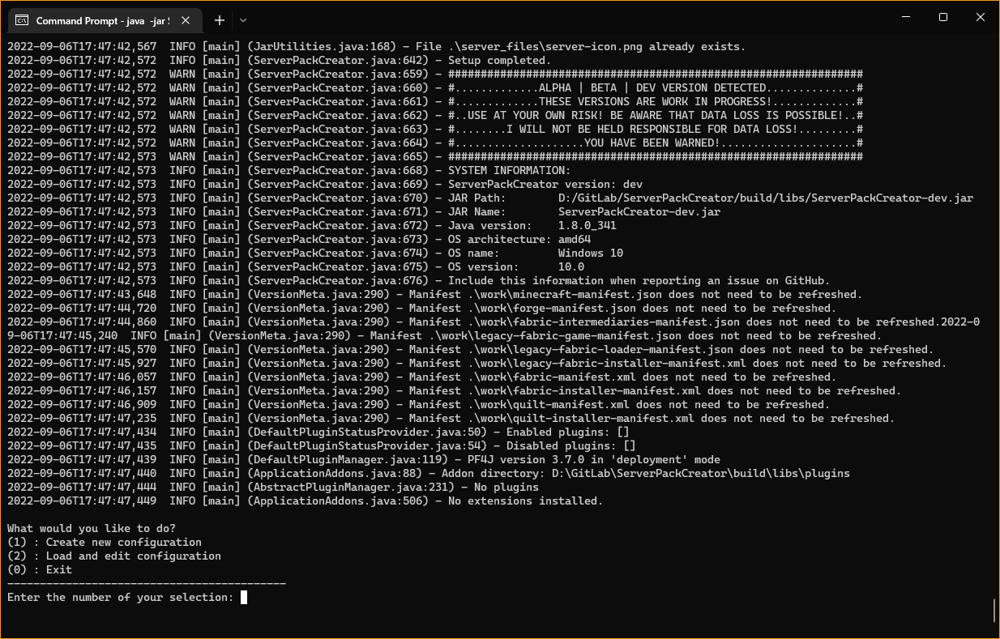
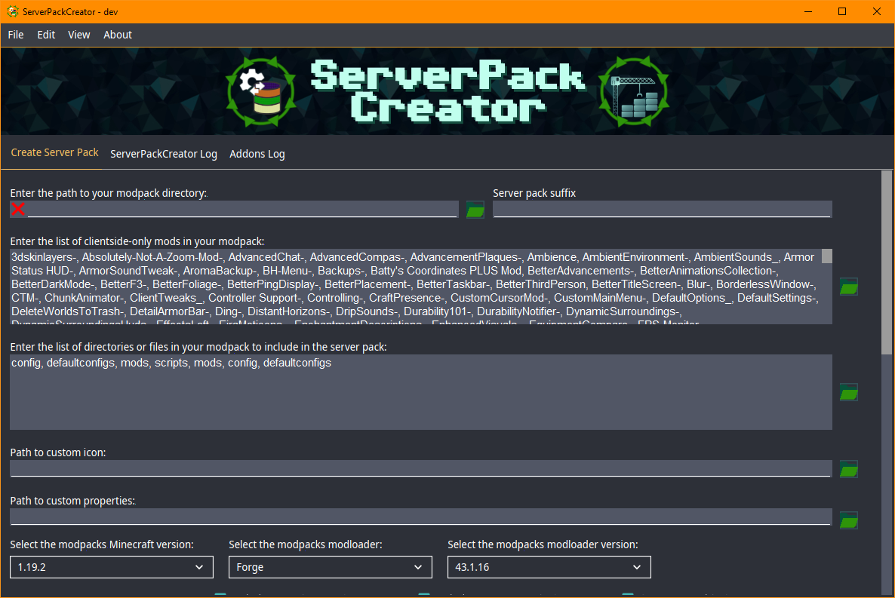
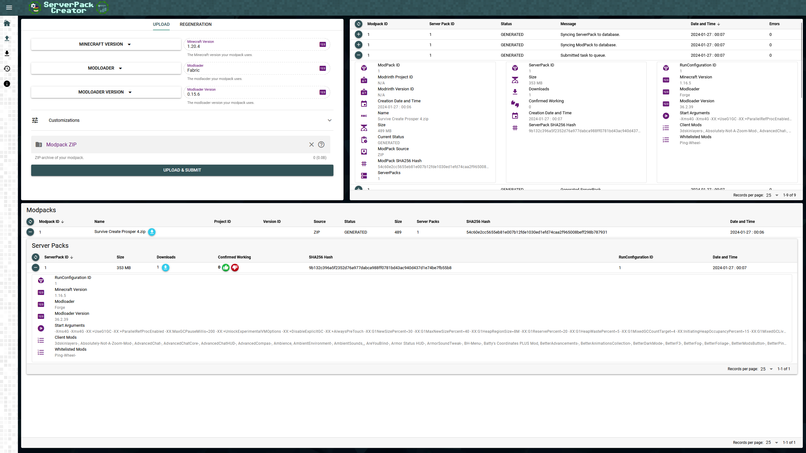

[](https://github.com/Griefed/ServerPackCreator)

[![Homepage](https://img.shields.io/badge/Griefed.de-Homepage-c0ffee?style=for-the-badge&labelColor=325358&logo=data:image/png;base64,iVBORw0KGgoAAAANSUhEUgAAAEAAAABACAMAAACdt4HsAAACylBMVEUAAAD////////////////////////////////////////////////////////////////////////////////////////////////////////////////////////////////////////////////////////////////////////////////////////////////////////////////////////////////////////////////////////////////////////////////////////////////////////////////////////////////////////////////////////////////////////////////////////////////////////////////////////////////////////////////////////////////////////////////////9/f39/f39/f39/f39/f39/f39/f39/f39/f39/f39/f39/f39/f39/f39/f39/f39/f39/f39/f39/f39/f39/f39/f39/f39/f39/f39/f39/f39/f39/f39/f39/f39/f39/f39/f39/f39/f39/f3+/v7+/v7+/v7+/v7+/v7+/v7+/v7+/v7+/v7+/v7+/v7+/v7+/v7+/v7+/v7+/v7+/v7+/v7+/v7+/v7+/v7+/v7+/v7+/v7+/v7+/v7+/v7+/v7+/v7+/v7+/v7+/v7+/v7+/v7+/v7+/v7+/v7+/v7+/v7+/v7+/v7+/v7+/v7+/v7+/v7+/v7+/v7+/v7+/v7+/v7+/v7+/v7+/v7+/v7+/v7+/v7+/v7+/v7+/v7+/v7+/v7+/v7+/v7+/v7+/v7+/v7+/v7+/v7+/v7+/v7+/v7+/v7+/v7+/v7+/v7+/v7+/v7+/v7+/v7+/v7+/v7+/v6OsnIvAAAA7XRSTlMAAQIDBAUGBwgJCgsMDQ4PEBESExQVFhcYGRobHB0eHyAhIiQlJicoKSorLC0uLzAxMjU2Nzg5Ojs8Pj9AQUJERUZHSElLTE9QUVJTVFVWV1hZXF1eX2BhYmNkZWZnaGlqa2xtbm9wcXJzdHV2d3h5ent8fX5/gIGCg4SGh4iJiouMjY6PkJGSk5SVlpeYmZqbnJ2en6Cio6WmqKmqq6ytrrCxsrO0tba3uLm6u7y9vr/AwcLDxMXGx8jKy8zNzs/Q0dLT1NXW2Nrb3N3e3+Dh4uPk5ebn6Onq6+zt7u/w8fLz9PX29/j5+vv8/f4O/wLaAAAGUklEQVR42o3WBVsb2xoF4G9PQqgXubktUnd3d3fFqjjHQt2Vg9Xd3TXU3d1b3KEugczM+g8nY5VAmrxYZGaxtj1A9jgfcoS1SdKTUx73gg2kYZzOTcdIYQjKeVWZnPJ7a91bh2zc6/SJWbNj16F9G+aNa12VkXGjBYU+5FTTz0DqmPphB9MsIjRCgXnRXRH42pSc6lQCgLdCIYoifsL3IqcG8FB8e34sISpkUnjUjKRj2VpeIDmjmweFdYeRkcr/mtYjK9CNfstnt1pAyFxmJA3XIi5VUDucqEeOsV5p6u2v5tbl6Cecb9RtC2T5Qxk5wE35rN5u8uPKhHuMPPZB/FgClEzXUbl0s3jg6S3+Ubgnlati1w1XB74ExPhyJ4KbzQNHasQHVyeHdH56nxQpoZwOLIyHuLkC6ciJSrtEiNMZ2ev3BdjgTi6ouAsoGUJ2amUCh9zJJZVSgHy71XQ7CDzwJhf5vQRO/DqR4wR87qYn1+gS7gHi0gGdmvp5cKSv4tOsd1A68PaaH7loAg8bvuTz23s+lPS66BsvAhDX66rWlDlt4vEYitIgojbZULzvwqSH/OOPy8iZCBGyPQYiFmSB7GgFBpuNNPrtWfOZW2bzlcvmlFtnzGdvms3XLppTbqeYz18/15YkXq8heVObbAwb5DjLCJID4qjfmTBDyNTuxpi/vHtOCTGEhrarE/FX1cGTR1eMiuxxsTVJYgWp7GiSGe/A5rYHMVy68eGU35wddXc3o/EJ7u4rxlKLXXVYxHx91Y0DqNv2/7E5C5QOflIFoSkpZktPIhkxPMzNB7AzpHdYjcjh3XsOifl/aO+QOlPHtRs84E/vqL6jmwZP6HFO6sDNlyr8STJ2GECqLxHDLTmgcINpxZNZplPHTbOeJps23ZlhOn/AtOD5UtOua7GxZxMfMCKql8UDpxhJKmdCFOI4Iia+KCoGYO5rZ/qGn591Ihtu+V4euVVJ0qwUqZdakM3UE6mb41Lj2pOdfn9TGcYa6bC2JMkwEfv8dSQJmBDtYSZyJYDYGWAUSf4BlpAiIMJ/4R0XA2g1MJMkiUCUFrCs34bnrgaYgLVyle0QA7SAwMAGZlcDJgC75YC9EMdqAXcXBDxyNWA8cJBsdCeBUC1gZijnuIFnTVVFkgQAR8iGOwxEawHjfUPPkL1mJ+/0JKKW36C6TpIQYA9JtgLztYB1AcnvyE717LeFX5sT9YMmlyR/qZNIC4Et3xs0DCjToGeSu25KZNmARO0XBwKXOTVgaQAzk53aNYn07ewDdLWOAQEkac8jx9+oBFyOL2cVmPxJjd6LqtPSjFzOBt9emdwi8IeXccoQRraxazDYpAqqvnqnagoRFy8ARZ4k4S4AQmY9ZRlbL3hFP2Ol0ERDk0PklwbgPEeymQCEeZwUMKNt/INfA/DdPz/NAYsW8OMItRYBvPKTAoKm+JpdCfC4A5s7RpKNldKEWCng2Sy7SWQiNFHQZNAoC2zE9QayqZMKyStPooA/ovVyA6Yh0w5VfOWl2sNhFY9DZglkRIZ9kAnh0ip4RF8gonioSgc9hKpggADVo24foMhuQxRiheJxdWkrrywmohS7gds9zN8oAhD5r4WvEsnn3tvPJcofyxBbg7bDU5wHfLr2EcgO7NnUp7KeuOq+TTr2TxCB+/G6gFUjmAsBeUNKIQTSz9wvAGm1KeDE2vHSKqyHih/5GqqPnZ/nqi6mAUfc6BdN3gKXqgSMH9DNTETBO1RrqoZrDxdzpKpyGciuTXbGWYGDocv7xWcQUS40fQRompOi0gHg2wCyxy0EkBXhP/cWEeVD0w/ftSIbHVXeBwjRjMrQrxOBq9OMV3SOAzwmJPifBwR1OHbc1wJIH5q2sWvFcofQwivyCX/3NSAu0VO59AutgNUifji2f+O/cbL5VYLiFPHJM16LkFj+5sgBbtxbyCx3on79f52rP/+12iVvMCPHGp8TIRNS/22hI40xLku9XTxel37LMDUPCvGKP6k4n708FEvdyJlgEYqis2tmhE+dGDZr/dl0KxR8f3KqN49yCTyAkg7kVLNvgHh72YViAd9Z81JMLcakAp+bkFM+RbCsMxLn1Wnism1Hjh/YsSp2ZMtqjIjq7LW+9SWnqrzODjCQijFGPxiC71Ynp/RJrZnjehzZ+Q9fNggLmTcf8AAAAABJRU5ErkJggg==)](https://www.griefed.de)
[](https://blog.griefed.de)
[](https://github.com/Griefed)
[](https://hub.docker.com/u/griefed)
[](https://discord.griefed.de)

---

For questions, you can always join my [Discord server](https://discord.griefed.de) and talk to me there.

---

[](https://github.com/Griefed/ServerPackCreator/releases/latest)
[](https://github.com/Griefed/ServerPackCreator/blob/main/LICENSE)

**ServerPackCreator creates a server pack from any given Forge, Fabric, Quilt, LegacyFabric and NeoForge modpack.**

**Whenever you are working on an update to your modpack, you simply run ServerPackCreator and BAM! You've got yourself a
server pack for your new modpack version.**

ServerPackCreator is a passion project on which I am working in my spare time. It is also the main reason for why I got into programming in the first place.
Patience with issues and support is appreciated!

I started getting into Java programming in February 2021, when I was working on an update for one of my Minecraft modpacks,
Survive Create Prosper 4, and got tired and bored with manually creating a server pack everytime I wanted to update and
test something, or just release a new server pack for the new modpack version.

The thought "*There must be a way to automate this, or at least make it less tedious...*" was the spark which sent me off
into the world of programming. And here we are.

**Disclaimer:**

* ServerPackCreator is not a guarantee for working server packs. It helps you create them, but you **must still test them**!
* You are still expected to be knowledgeable about your modpack, server packs in general, server administration and managing your Java installations. ServerPackCreator is not intended to take all the work off your shoulders!
* When using alpha, beta or in-dev version of ServerPackCreator, it is advised to make a backup of your ServerPackCreator-directory in your home-directory.
* Things will break with alpha releases, stuff may break when using beta releases.
* If you distribute server packs generated with a pre-release (alpha, beta) of ServerPackCreator, you do so at your own risk.
* I will not be held responsible for errors in your server pack caused by you using a pre-release.
* I will not be held responsible for errors in your server pack in general. **Test your server packs before you ship them!**
* **TL;DR:** Don't use test to ship to prod! **Test** before shipping!

**Pre-Releases:**

There are two kinds of pre-releases: Alphas and Betas

* Alphas: Missing features, incomplete features, almost guaranteed to have bugs / errors
* Betas: Feature complete, probably contains bugs / errors

## Screenshots

| CLI                 | GUI                           | WEB                 |
|---------------------|-------------------------------|---------------------|
|  |  |  |

## Advantages/Disadvantages of CLI, GUI and WEB:

Each way of using ServerPackCreator has its advantages and disadvantages. Depending on your environment, it may be better to use one way over the other. This section highlights some of the
advantages and disadvantages of each version to help you decide which way you are going to use.
Note: All three ways are supported by the **.jar**-file. Which one is started depends on the CLI arguments used and your environment.

### CLI:

| Advantages                                                                                                                                                                                               | Disadvantages                                                                                                         |
|:---------------------------------------------------------------------------------------------------------------------------------------------------------------------------------------------------------|:----------------------------------------------------------------------------------------------------------------------|
| No need for a graphical environment. Can be used on a server to generate a server pack for immediate use.                                                                                                | Gathering of information for a configuration file is tedious.                                                         |
| Step-by-Step generation of a configuration-file with the use of the `-cgen` argument. Generated config will be used immediately afterwards.                                                              | No convenience features file folder-browsing or jumping to the generated server pack after generation.                |
| Load and edit an existing configuration. Editing is limited to base values of a given configuration. Not editable via CLI are script settings as well as any potentially installed plugin configuration. | Debugging in case of a broken/erroring configuration file can be time consuming. Careful reading of logs is required. |
|                                                                                                                                                                                                          | Manual editing of the configuration-file in case you want to change it.                                               |
|                                                                                                                                                                                                          | Unable to edit start script placeholders and variables                                                                |

### GUI:

| Advantages                                                                                                             | Disadvantages                     |
|:-----------------------------------------------------------------------------------------------------------------------|:----------------------------------|
| Browse the filesystem for folders and file required by the configuration.                                              | Requires a graphical environment. |
| Setting up a configuration by browsing the filesystem and selecting your Minecraft and modloader versions from a list. |                                   |
| Browsing the generated server pack after generation has finished.                                                      |                                   |
| Loading and saving different configurations for quick generation of multiple server packs in short succession.         |                                   |
| Edit the configuration in the GUI. No manual file-editing required.                                                    |                                   |
| Edit start script placeholders and values                                                                              |                                   |

## WEB:

| Advantages                                                    | Disadvantages                                                  |
|:--------------------------------------------------------------|:---------------------------------------------------------------|
| No software installation on clients required                  | Requires a server with sufficient space                        |
| Easy access via web-browser                                   | Requires server-administration knowledge for setup and control |
| Quickly share mod- and server packs with friends / colleagues | No custom script templates                                     |
| Multiple server packs for the same modpack                    | No custom server icons                                         |
| Re-use configurations                                         | No custom server-properties                                    |
|                                                               | No custom server pack suffix                                   |
|                                                               | No custom script variables or values                           |
|                                                               | No custom inclusions or exclusions                             |

---

## 1. Small feature overview

1. **Exclude clientside-only mods**
    - **Automatically** by letting ServerPackCreator scan the mods of your modpack for their sideness
    - **Manually** by configuring a list mods which ServerPackCreator will filter out according to your input and the chosen filter.
2. **Add files and directories** in your server pack.
    - Files and directories in **your modpack**
    - Files and directories from **your computer**
3. **Add a server icon**
    - Server icons are **automatically scaled** down, or up, to 64x64!
    - Specify a custom one, or use a default provided by ServerPackCreator.
        - Change the default to your liking if you intend on using the same icon across multiple server packs!
4. **Add a server.properties**
    - Ship your server pack with default settings!
    - Specify a custom one, or use a default provided by ServerPackCreator.
        - Change the default to your liking if you intend on using the same icon across multiple server packs!
5. Many **modloaders** supported
    - **Forge**
    - **Fabric**
    - **LegacyFabric**
    - **Quilt**
    - **NeoForge**
6. Use Minecraft **snapshots** and **pre-releases**
    - Per default, only regular releases enabled
7. Let ServerPackCreator **install the modloader-server** for your server pack, for immediate testing and debugging after generation!
8. Let ServerPackCreator **generate a ZIP-archive**, for immediate upload to places like CurseForge (**after** you've tested your server pack, of course 😉)
9. Configure **commandline arguments** with which to **start** the **Minecraft server**
    - Does your modpack require **a lot of RAM?** Well, tell ServerPackCreator to create the start scripts with `-Xms8G -Xmx8G` or similar values!
    - **Aikars flags** are available, too. If you like 'em, use 'em.
10. Create your own **start-script templates**
    - **Add additional functionality** to your servers start scripts
    - Use **placeholders in your templates**, to be **replaced with custom values**
        - Example: placeholder `SPC_FLYNN_LIVES_SPC` in the templates can be replaced with a value configured on a per-server pack basis, i.e `Now that's a big door`
11. **Plugins!**
    - ServerPackCreator allows you to use plugins to add new features in various places.
    - An example plugins is available with every release, and the source code for it can be found in this repository, at [Example Plugin](serverpackcreator-plugin-example)

## 2. Issues and help

- Report a bug / ask for a feature / ask for an improvement / request a documentation improvement:
    - https://github.com/Griefed/ServerPackCreator/issues/new/choose
- There's a Wiki available which goes into further detail for many of ServerPackCreators available aspects:
    - https://help.serverpackcreator.de/help-topic.html
- The same as the Wiki, but as a file should you prefer it. 😊
    - [HELP.md](HELP.md)

## 3. How To

The first time you start ServerPackCreator, you will be asked whether you want to see a small step-by-step guide.
Said guide will show you the most important parts in configuring your server pack.

Should you at any point want to revisit said guide, simply hit *About -> Step-By-Step Guide* in the menu at the top. 

**[kreezxil](https://github.com/kreezxil) has made a video showing a step-by-step video-tutorial for ServerPackCreator:**

[](https://www.youtube.com/watch?v=0Rh2q0fr8xA "Server Pack Creator Guide: Turn Your CurseForge Modpack into a Bisect Hosting Server!")

## 4. Java

### Required:

* Using the JAR-file release requires Java 21.
* Working internet connection recommended.

The installers ship their own Java installations.

**ATTENTION:** I **can** not and **will** not guarantee that ServerPackCreator will work flawlessly with any other Java
version other than version 21. Things may break at **random**, at **any** place, if a **different** Java version is used.
You are welcome to try and use any other version, but do **not** report issues back to me if you do encounter problems
when running ServerPackCreator with a more recent Java version.

## 5 Running

1. If you've used the installer to acquire ServerPackCreator, use the shortcut created by the installer to run
ServerPackCreator. The installers provide their own Java runtime, so you do not need to install Java separately.
2. If you've downloaded the JAR-file, and depending on how your Java installation is set up, you *may* be able to simply
run the JAR via double-click or other methods, or you *may* need to run it from the commandline.

There are a couple of arguments which may or may not be helpful for you, depending on how you plan on using ServerPackCreator:

| Argument  | Description                                                                                                                                                                                                             |
|-----------|-------------------------------------------------------------------------------------------------------------------------------------------------------------------------------------------------------------------------|
| `-help`   | Print ServerPackCreators help to commandline.                                                                                                                                                                           |
| `-update` | Check whether a newer version of ServerPackCreator is available.                                                                                                                                                        |
| `-cgen`   | Run ServerPackCreators configuration generation.                                                                                                                                                                        |
| `-cli`    | Run ServerPackCreator in commandline-mode. If **no** graphical environment is supported, this is the default ServerPackCreator will enter, even when starting ServerPackCreator with no extra arguments at all.         |
| `-web`    | Run ServerPackCreator as a webservice.                                                                                                                                                                                  |
| `-gui`    | Run ServerPackCreator with our GUI. If a graphical environment is supported, this is the default ServerPackCreator will enter, even when starting ServerPackCreator with no extra arguments at all.                     |
| `--setup` | Set up and prepare the environment for subsequent runs of ServerPackCreator. This will create/copy all files needed for ServerPackCreator to function properly from inside its JAR-file and setup everything else, too. |

### 5.1 Running ServerPackCreator as a webservice

**DISCLAIMER**

**There is no publicly available instance of ServerPackCreators webservice due to security concerns with the ability to upload zip-archives. If you want to make use of the webservice, you will have to host your own instance.**
**As such, you are advised to not make your instance of the webservice of ServerPackCreator publicly accessible.**

ZIP-archives uploaded by anonymous people may contain illegal or otherwise dangerous data, which could corrupt your system or get you into legal trouble.

If you want to open your webservice-instance to the public, make sure to properly protect it by putting it behind required authorization.

#### 5.1.1 JAR

1. Download the JAR-file from the latest release
2. Run it once, using the `-web` argument. ServerPackCreator will crash, complaining about JDBC-related things. This is expected, don't worry.
3. Browser to the now generated ServerPackCreator home-directory
    1. Unsure where said home-directory is? Check the logs for `Home directory set to:`! 
4. Install / setup / provide a MongoDB-database for ServerPackCreator. See [MongoDB Installation Tutorial](https://www.mongodb.com/docs/manual/installation/)
5. Set the database-properties in the `serverpackcreator.properties` according to your database
   1. `spring.data.mongodb.uri=`
       - Example:`mongodb\://<USER>:<PASSWORD>@localhost\:27017/serverpackcreatordb`
       - If the username or password includes the following characters `$ : / ? # [ ] @`, those characters must be converted using percent encoding (https://datatracker.ietf.org/doc/html/rfc3986#section-2.1) : `$ : / ? # [ ] @`

6. Run ServerPackCreator, using the `-web`-argument, again
7. Browse to `http://localhost:8080`

##### 5.1.1.1 Tweaking the webservice

You may edit the following properties inside the `serverpackcreator.properties` if you wish to change some parts of the webservice-behaviour:

| Property                                                               | Description                                                                                                                          |
|------------------------------------------------------------------------|--------------------------------------------------------------------------------------------------------------------------------------|
| `de.griefed.serverpackcreator.spring.schedules.database.cleanup`       | Time when the database-cleanup operations run.                                                                                       |
| `de.griefed.serverpackcreator.spring.schedules.files.cleanup`          | Time when the filesystem-cleanup operations run.                                                                                     |
| `de.griefed.serverpackcreator.spring.schedules.versions.refresh`       | Time when the version-refresh operation runs.                                                                                        |
| `spring.servlet.multipart.max-file-size`                               | In combination with the property below, this sets the maximum upload size of modpacks.                                               |
| `spring.servlet.multipart.max-request-size`                            | See above.                                                                                                                           |
| `de.griefed.serverpackcreator.configuration.directories.mustinclude`   | Directories which must be included in a server pack, if they are present in a modpack.                                               |
| `de.griefed.serverpackcreator.configuration.directories.shouldexclude` | Directories which should be excluded from a server pack.                                                                             |
| `de.griefed.serverpackcreator.configuration.fallback.updateurl`        | URL to a `.properties`-file which contains definitions for clientside-only mods.                                                     |
| `de.griefed.serverpackcreator.serverpack.autodiscovery.enabled`        | Whether ServerPackCreator should try to automatically excluded clientside-mods, in addition to the list of excluded clientside-mods. |
| `de.griefed.serverpackcreator.serverpack.autodiscovery.filter`         | Filter method used to exclude mods from the clientside-only list. Possible values are `START`, `END`, `CONTAIN`, `REGEX`, `EITHER`   |
| `de.griefed.serverpackcreator.serverpack.zip.exclude`                  | Files or directories which should be excluded from a server pack archive.                                                            |
| `de.griefed.serverpackcreator.serverpack.zip.exclude.enabled`          | Whether files should be excluded from a server pack archive.                                                                         |
| `server.port`                                                          | The port at which the webservice will be available at. Default is `8080`.                                                            |

#### 5.1.2 Docker (recommended)

The recommended, and easiest, way to deploy ServerPackCreator as a webservice is via [docker](https://www.docker.com/) and [docker-compose](https://docs.docker.com/compose/).

Available images can be viewed at https://hub.docker.com/r/griefed/serverpackcreator/tags

**About Tags:**
The example below makes use of the `latest`-tag. However, using said tag is not recommended, as there may be breaking changes between versions.
When setting up ServerPackCreator as a webservice for production, make sure to *not* use `latest` and instead use the tag corresponding to the, at this point, latest available release version available.

You must replace `<DB_ROOT_USERNAME>` and `<DB_ROOT_PASSWORD>` accordingly.
Do note the `- ./init-mongo.js:/docker-entrypoint-initdb.d/init.js:ro` in the **serverpackcreatorb**-service.
An example for this file is available at [docker/docker/init-mongo.js](docker/init-mongo.js). This init-script initializes
the MongoDB with the required user, database and collection.

```yaml
version: '3'
services:
  serverpackcreatordb:
    image: mongodb/mongodb-community-server:8.0.5-ubuntu2204
    container_name: serverpackcreatordb
    restart: unless-stopped
    environment:
      MONGO_INITDB_ROOT_USERNAME: <DB_ROOT_USERNAME>
      MONGO_INITDB_ROOT_PASSWORD: <DB_ROOT_PASSWORD>
      MONGO_INITDB_DATABASE: serverpackcreatordb
    volumes:
      - ./init-mongo.js:/docker-entrypoint-initdb.d/init.js:ro
      - spcdb-data:/data/db
      - spcdb-conf:/data/configdb

  serverpackcreator:
    container_name: serverpackcreator
    image: griefed/serverpackcreator:latest # For a list of available tags, see https://hub.docker.com/r/griefed/serverpackcreator/tags
    restart: unless-stopped
    depends_on:
      - serverpackcreatordb
    environment:
      - TZ=Europe/Berlin # Your timezone
      - PUID=1000 # Your user ID
      - PGID=1000 # Your group ID
      - SPC_DATABASE_PASSWORD=<DB_ROOT_USERNAME> # $ : / ? # [ ] @ those characters must be converted using https://datatracker.ietf.org/doc/html/rfc3986#section-2.1
      - SPC_DATABASE_USERNAME=<DB_ROOT_PASSWORD> # $ : / ? # [ ] @ those characters must be converted using https://datatracker.ietf.org/doc/html/rfc3986#section-2.1
      - SPC_DATABASE_HOST=serverpackcreatordb  # Do not change this unless you absolutely know what you are doing.
      - SPC_DATABASE_PORT=27017  # Do not change this unless you absolutely know what you are doing.
      - SPC_DATABASE_DB=serverpackcreator # Do not change this unless you absolutely know what you are doing.
    ports:
      - "8080:8080" # Port at which SPC will be available at on your host : Port of the webservice inside the container. Only change the left value, it at all.
    volumes:
      - ./modpacks:/app/serverpackcreator/modpacks # Path at which modpacks from the container will be stored at on your host : Path to the modpacks in the container. Only change the left value, if at all.
      - ./server-packs:/app/serverpackcreator/server-packs # Path at which server packs from the container will be stored at on your host : Path to the server packs in the container. Only change the left value, if at all.
      - ./logs:/app/serverpackcreator/logs # Path at which logs from the container will be stored at on your host : Path to the logs in the container. Only change the left value, if at all.

volumes:
  spcdb-data:
  spcdb-conf:
```

##### 5.1.2.1 Tweaking the docker deployment

You may edit the following container-properties if you wish to change some parts of the webservice-behaviour:

| Property                                      | Description                                                                                                                          |
|-----------------------------------------------|--------------------------------------------------------------------------------------------------------------------------------------|
| `SPC_SCHEDULE_DATABASE_CLEANUP`               | Time when the database-cleanup operations run.                                                                                       |
| `SPC_SCHEDULE_FILES_CLEANUP`                  | Time when the filesystem-cleanup operations run.                                                                                     |
| `SPC_SCHEDULE_VERSIONS_REFRESH`               | Time when the version-refresh operation runs.                                                                                        |
| `SPC_MAX_UPLOAD_SIZE`                         | This sets the maximum upload size of modpacks.                                                                                       |
| `SPC_CONFIGURATION_DIRECTORIES_MUSTINCLUDE`   | Directories which must be included in a server pack, if they are present in a modpack.                                               |
| `SPC_CONFIGURATION_DIRECTORIES_SHOULDEXCLUDE` | Directories which should be excluded from a server pack.                                                                             |
| `SPC_CONFIGURATION_FALLBACK_UPDATEURL`        | URL to a `.properties`-file which contains definitions for clientside-only mods.                                                     |
| `SPC_SERVERPACK_AUTODISCOVERY_ENABLED`        | Whether ServerPackCreator should try to automatically excluded clientside-mods, in addition to the list of excluded clientside-mods. |
| `SPC_SERVERPACK_AUTODISCOVERY_FILTER`         | Filter method used to exclude mods from the clientside-only list. Possible values are `START`, `END`, `CONTAIN`, `REGEX`, `EITHER`   |
| `SPC_SERVERPACK_ZIP_EXCLUDE`                  | Files or directories which should be excluded from a server pack archive.                                                            |
| `SPC_SERVERPACK_ZIP_EXCLUDE_ENABLED`          | Whether files should be excluded from a server pack archive.                                                                         |

## 6. API

ServerPackCreator's API is available on maven for use in your own projects: https://central.sonatype.com/artifact/de.griefed.serverpackcreator/serverpackcreator-api

Note: The API does not include the REST-API of the webservice in the app. It is explicitly *not* part of the ServerPackCreator API.

### Implementation

Replace `$VERSION` with the version you want to use.

#### Maven

```XML
<dependency>
    <groupId>de.griefed.serverpackcreator</groupId>
    <artifactId>serverpackcreator-api</artifactId>
    <version>$VERSION</version>
</dependency>
```

#### Gradle

```kotlin
implementation 'de.griefed.serverpackcreator:serverpackcreator-api:$VERSION'
```

#### Gradle Kotlin

```kotlin
implementation("de.griefed.serverpackcreator:serverpackcreator-api:$VERSION")
```

### Example

Initialize the API with your properties file, containing some basic settings for the API to use.
`/path/to/file.properties` represents the path to your properties-file.

Make sure to select a directory which doesn't contain any vital data for the API, as the API will setup and create
any and all required files in said directory. Best to give it its own directory all to itself.

For information about possible settings, see https://help.serverpackcreator.de/settings-and-configs.html#serverpackcreator-properties

```kotlin
val spcAPI = ApiWrapper.api(File("/path/to/file.properties"))
```

After initializing the API you can now access the ConfigurationHandler as well as the ServerPackHandler, among other things.
Here's a very basic example:

```kotlin
val packConfig = PackConfig()
val configCheck = spcAPI.configurationHandler.checkConfiguration(File("/path/to/serverpack-config.conf"), packConfig)

if (configCheck.allChecksPassed) {
    val serverPackGeneration = spcAPI.serverPackHandler.run(packConfig)

    if (serverPackGeneration.success) {
        println("Path to your server pack: ${serverPackGeneration.serverPack.absolutePath}")

        if (serverPackGeneration.serverPackZip.isPresent) {
            println("Path to your server pack ZIP: ${serverPackGeneration.serverPackZip.get().absolutePath}")
        }
        
    } else {
        
        println("Encountered the following errors during generation:")
        for (error in serverPackGeneration.errors) {
            println(error)
        }
        
    }
    
} else {
    
    println("There are errors in your server pack config:")
    for (error in configCheck.encounteredErrors) {
        println(error)
    }
    
}
```

## 7. Awesomesauce!

**None of this would have been possible without the excellent IDEs by JetBrains. They have kindly provided this open source project with an All Products Pack license.**
**Additionally, ej-Technologies has provided an open-source license for JProfiler and install4j for ServerPackCreator, which allows me to resolve performance bottlenecks, pin down memory leaks and understand threading issues, as well as generated fancy high-end installers.
Huge shoutout and thank you!**

| [JetBrains](https://www.jetbrains.com/)                     | [IntelliJ IDEA](https://www.jetbrains.com/idea/)                                | [WebStorm](https://www.jetbrains.com/webstorm/)                           | [Writerside](https://www.jetbrains.com/writerside/)                             | [YouTrack](https://www.jetbrains.com/youtrack/)                           | [JProfiler](https://www.ej-technologies.com/products/jprofiler/overview.html)                                                                                                                                       | [install4j](https://www.ej-technologies.com/products/install4j/overview.html)                                                                                                                                     |
|-------------------------------------------------------------|---------------------------------------------------------------------------------|---------------------------------------------------------------------------|---------------------------------------------------------------------------------|---------------------------------------------------------------------------|---------------------------------------------------------------------------------------------------------------------------------------------------------------------------------------------------------------------|-------------------------------------------------------------------------------------------------------------------------------------------------------------------------------------------------------------------|
| [](https://www.jetbrains.com/) | [](https://www.jetbrains.com/idea/) | [](https://www.jetbrains.com/webstorm/) | [](https://www.jetbrains.com/writerside/) | [](https://www.jetbrains.com/youtrack/) | [](https://www.ej-technologies.com/products/jprofiler/overview.html)<br>[](https://www.ej-technologies.com/products/jprofiler/overview.html) | [](https://www.ej-technologies.com/products/install4j/overview.html)<br>[](https://www.ej-technologies.com/products/install4j/overview.html) |

*Starting from version 6.x, ServerPackCreator will sport fancy new installers made possible by ej-technologies' install4j.*

---

## ✨ Thanks to all of my Supporters and Sponsors ✨

### Sponsors

<!-- sponsors --><a href="https://github.com/kreezxil"></a><a href="https://github.com/thrasosc"></a><a href="https://github.com/Calmingstorm"></a><!-- sponsors -->

### Contributors

<!-- contributors -->

<table>
  <tr>
    <td width="150" align="center">
      <a href="https://github.com/Griefed" title="Griefed">
        
        <br />
        Griefed
      </a>
    </td>
    <td width="150" align="center">
      <a href="https://github.com/apps/dependabot" title="dependabot[bot]">
        
        <br />
        dependabot[bot]
      </a>
    </td>
    <td width="150" align="center">
      <a href="https://github.com/whitebear60" title="whitebear60">
        
        <br />
        whitebear60
      </a>
    </td>
    <td width="150" align="center">
      <a href="https://github.com/MoonstruckDev" title="MoonstruckDev">
        
        <br />
        MoonstruckDev
      </a>
    </td>
    <td width="150" align="center">
      <a href="https://github.com/apps/dependabot-preview" title="dependabot-preview[bot]">
        
        <br />
        dependabot-preview[bot]
      </a>
    </td>
  </tr><tr>
    <td width="150" align="center">
      <a href="https://github.com/Alistair1231" title="Alistair1231">
        
        <br />
        Alistair1231
      </a>
    </td>
    <td width="150" align="center">
      <a href="https://github.com/arthurbarret0" title="arthurbarret0">
        
        <br />
        arthurbarret0
      </a>
    </td>
    <td width="150" align="center">
      <a href="https://github.com/trimclain" title="trimclain">
        
        <br />
        trimclain
      </a>
    </td>
    <td width="150" align="center">
      <a href="https://github.com/thrasosc" title="thrasosc">
        
        <br />
        thrasosc
      </a>
    </td>
    <td width="150" align="center">
      <a href="https://github.com/apps/github-actions" title="github-actions[bot]">
        
        <br />
        github-actions[bot]
      </a>
    </td>
  </tr><tr>
    <td width="150" align="center">
      <a href="https://github.com/w51637382" title="w51637382">
        
        <br />
        w51637382
      </a>
    </td>
    <td width="150" align="center">
    </td>
    <td width="150" align="center">
    </td>
    <td width="150" align="center">
    </td>
    <td width="150" align="center">
    </td>
  </tr>
</table>

<!-- contributors end -->